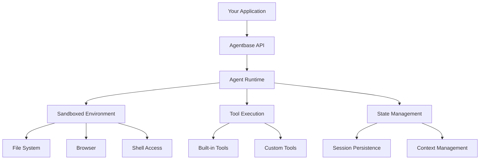

Build production-ready AI agents with simple APIs. Agentbase handles infrastructure so you can focus on what your agents do.

## How to Build an Agent

<CardGroup cols={3}>
  <Card title="Build" icon="hammer">
    Create agents with system prompts, custom tools, and rules
  </Card>

  <Card title="Deploy" icon="rocket">
    Run agents in production with automatic scaling
  </Card>

  <Card title="Optimize" icon="chart-line">
    Monitor performance and improve with traces and evals
  </Card>
</CardGroup>

## What You Can Build

Agentbase agents can handle a wide variety of tasks with built-in capabilities:

<AccordionGroup>
  <Accordion title="Code & Development" icon="code">
    **Built-in capabilities:**
    - Write, test, and debug code in Python, Node.js, and more
    - Install packages and manage dependencies
    - Run tests and validate outputs
    - Work with files and Git repositories

    **Example tasks:**
    - "Create a REST API with authentication"
    - "Write unit tests for my Python module"
    - "Debug this error and fix the code"
  </Accordion>

  <Accordion title="Research & Analysis" icon="magnifying-glass">
    **Built-in capabilities:**
    - Search the web for real-time information
    - Crawl and scrape websites
    - Process and analyze data
    - Synthesize insights from multiple sources

    **Example tasks:**
    - "Research our top 3 competitors and their pricing"
    - "Analyze this dataset and create visualizations"
    - "Find the latest AI research papers on this topic"
  </Accordion>

  <Accordion title="Browser Automation" icon="browser">
    **Built-in capabilities:**
    - Navigate websites and fill forms
    - Extract data from web pages
    - Test web applications
    - Automate repetitive browser tasks

    **Example tasks:**
    - "Fill out this form submission"
    - "Test the checkout flow on our website"
    - "Monitor competitor pricing daily"
  </Accordion>

  <Accordion title="Data Processing" icon="database">
    **Built-in capabilities:**
    - Read and write various file formats
    - Transform and clean data
    - Generate reports and summaries
    - Work with APIs and integrations

    **Example tasks:**
    - "Convert these CSV files to JSON"
    - "Process customer feedback and categorize by sentiment"
    - "Generate a weekly report from our analytics"
  </Accordion>
</AccordionGroup>

## Quick Start

<Steps>
  <Step title="Create Your Agent">
    ```bash
    npm create agentbase@latest
    cd my-agent
    npm run dev
    ```
  </Step>

  <Step title="Test Capabilities">
    Try a prompt to see what agents can do:
    ```
    > Create a Python function to calculate fibonacci numbers
    ```
  </Step>

  <Step title="Customize Your Agent">
    Add custom tools, system prompts, and rules to match your needs
  </Step>
</Steps>

## Core Concepts

<CardGroup cols={2}>
  <Card title="Agent Primitives" icon="cube" href="/primitives/overview">
    Understand the building blocks: environments, tools, states, sessions, and more
  </Card>

  <Card title="Agent Modes" icon="gauge" href="/build/agent-modes">
    Choose between Flash, Fast, and Max modes based on task complexity
  </Card>

  <Card title="System Prompts" icon="message" href="/build/system-prompts">
    Guide how agents approach tasks and make decisions
  </Card>

  <Card title="Custom Tools" icon="wrench" href="/primitives/essentials/custom-tools">
    Extend agent capabilities with your own tools and APIs
  </Card>
</CardGroup>

## Architecture

Agentbase handles all the complex infrastructure so you don't have to:



**What Agentbase manages for you:**
- Agent orchestration and reasoning
- Sandboxed execution environments
- Tool selection and execution
- State and session persistence
- Scaling and load balancing
- Security and compliance

## Agent Primitives

Build sophisticated agents using Agentbase primitives - the building blocks that power agent functionality:

<CardGroup cols={3}>
  <Card title="Environment" icon="server" href="/primitives/overview">
    **Sandbox, File System, Computer, Browser**
    
    Execution environments where agents operate with full isolation and security
  </Card>

  <Card title="Essentials" icon="wrench" href="/primitives/overview">
    **Prompts, Tools, Sessions, States**
    
    Core capabilities every agent needs for interaction and memory
  </Card>

  <Card title="Extensions" icon="puzzle-piece" href="/primitives/overview">
    **Memory, RAG, Workflows, Voice**
    
    Advanced features for specialized use cases and complex workflows
  </Card>
</CardGroup>

<Card title="Explore All Primitives" icon="cubes" href="/primitives/overview">
  See all 35+ primitives and learn how they work together →
</Card>

## Next Steps

<CardGroup cols={2}>
  <Card title="Quick Start Guide" icon="rocket" href="/build/quickstart">
    Get your first agent running in 2 minutes
  </Card>

  <Card title="Common Use Cases" icon="lightbulb" href="/build/use-cases">
    See real-world examples and patterns
  </Card>

  <Card title="Agent Primitives" icon="cubes" href="/primitives/overview">
    Deep dive into agent building blocks
  </Card>

  <Card title="Deploy to Production" icon="cloud" href="/deploy/overview">
    Learn how to deploy agents in production
  </Card>
</CardGroup>
