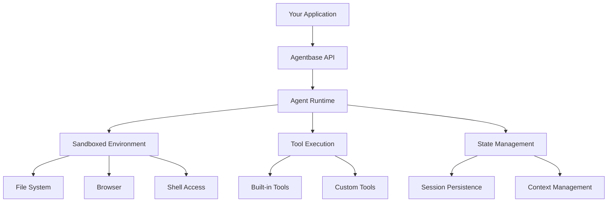

Build production-ready AI agents with simple APIs. Agentbase handles infrastructure so you can focus on what your agents do.

We designed Agentbase to make creating AI agents stupidly easy. You can start with the bootstrap commands or SDK, and begin by giving your agent a system prompt and a set of rules. Each agent comes with built-in primitives, so you don't need to set up a new environment. It already runs on a persistent computer with browser access, web search, MCP, and other capabilities.

## What You Can Build

People build both internal agents (for automating internal workflows) and external agents (for customer-facing applications). Agentbase agents can handle a wide variety of tasks with built-in capabilities:

<AccordionGroup>
  <Accordion title="Code & Development" icon="code">
    **Built-in capabilities:**
    - Write, test, and debug code in Python, Node.js, and more
    - Install packages and manage dependencies
    - Run tests and validate outputs
    - Work with files and Git repositories

    **Example tasks:**
    - "Create a REST API with authentication"
    - "Write unit tests for my Python module"
    - "Debug this error and fix the code"
  </Accordion>

  <Accordion title="Research & Analysis" icon="magnifying-glass">
    **Built-in capabilities:**
    - Search the web for real-time information
    - Crawl and scrape websites
    - Process and analyze data
    - Synthesize insights from multiple sources

    **Example tasks:**
    - "Research our top 3 competitors and their pricing"
    - "Analyze this dataset and create visualizations"
    - "Find the latest AI research papers on this topic"
  </Accordion>

  <Accordion title="Browser Automation" icon="browser">
    **Built-in capabilities:**
    - Navigate websites and fill forms
    - Extract data from web pages
    - Test web applications
    - Automate repetitive browser tasks

    **Example tasks:**
    - "Fill out this form submission"
    - "Test the checkout flow on our website"
    - "Monitor competitor pricing daily"
  </Accordion>

  <Accordion title="Data Processing" icon="database">
    **Built-in capabilities:**
    - Read and write various file formats
    - Transform and clean data
    - Generate reports and summaries
    - Work with APIs and integrations

    **Example tasks:**
    - "Convert these CSV files to JSON"
    - "Process customer feedback and categorize by sentiment"
    - "Generate a weekly report from our analytics"
  </Accordion>
</AccordionGroup>

Most developers start by defining their agent's behavior with a **system prompt** that sets personality and expertise, then add **rules** for constraints and compliance. Each agent automatically gets access to built-in **primitives** like web browsing, file systems, and tools - no setup required. Instead of configuring and setting up your own infrastructure, you can utilize ours as a managed service. As they build, they'll create custom tools and functions, use primitives like data stores and MCP, and evaluate agents with traces.

## Core Concepts

| Concept | Description | Link |
|---------|-------------|------|
| **Agent Primitives** | Understand the building blocks: environments, tools, states, sessions, and more | [Learn more →](/primitives/overview) |
| **Agent Modes** | Choose between Flash, Base, and Max modes based on task complexity | [Learn more →](/getting-started/agent-modes) |
| **System Prompts** | Guide how agents approach tasks and make decisions | [Learn more →](/build/system-prompts) |
| **Custom Tools** | Extend agent capabilities with your own tools and APIs | [Learn more →](/primitives/essentials/custom-tools) |

## Architecture

Agentbase handles all the complex infrastructure so you don't have to:

**What Agentbase manages for you:**
- Agent orchestration and reasoning
- Sandboxed execution environments
- Tool selection and execution
- State and session persistence
- Scaling and load balancing
- Security and compliance

## Agent Primitives

Build sophisticated agents using Agentbase primitives - the building blocks that power agent functionality:

<CardGroup cols={3}>
  <Card title="Environment" icon="server" href="/primitives/overview">
    **Sandbox, File System, Computer, Browser**
    
    Execution environments where agents operate with full isolation and security
  </Card>

  <Card title="Essentials" icon="wrench" href="/primitives/overview">
    **Prompts, Tools, Sessions, States**
    
    Core capabilities every agent needs for interaction and memory
  </Card>

  <Card title="Extensions" icon="puzzle-piece" href="/primitives/overview">
    **Memory, RAG, Workflows, Voice**
    
    Advanced features for specialized use cases and complex workflows
  </Card>
</CardGroup>

<Card title="Explore All Primitives" icon="cubes" href="/primitives/overview">
  See all 35+ primitives and learn how they work together →
</Card>

