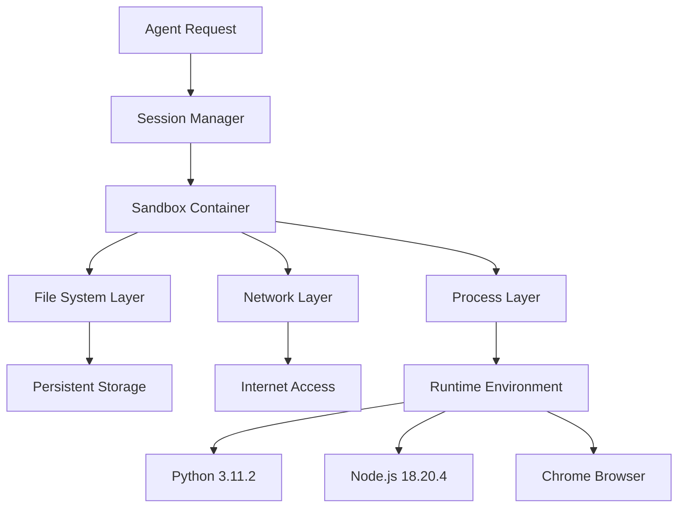

> Each agent session runs in its own isolated sandbox environment, providing security, resource isolation, and clean state management.

## Overview

The Sandbox primitive is the foundation of Agentbase's execution model. Every agent session operates within its own isolated sandbox - a lightweight, secure container that provides a clean execution environment. This isolation ensures that:

- **Security**: Agent operations are contained and cannot affect other sessions or the host system
- **Resource Isolation**: Each sandbox has dedicated CPU, memory, and disk resources
- **Clean State**: Every new session starts with a fresh environment
- **Predictable Execution**: Consistent runtime conditions across all sessions

<CardGroup cols={2}>
  <Card title="Automatic Creation" icon="sparkles">
    Sandboxes are created automatically when you run an agent - no manual setup required
  </Card>

  <Card title="Session-Based" icon="link">
    Each sandbox is tied to a session ID and can be reused across multiple requests
  </Card>

  <Card title="Resource Managed" icon="gauge">
    Automatic resource allocation and cleanup based on workload requirements
  </Card>

  <Card title="Network Enabled" icon="wifi">
    Full internet access for API calls, package downloads, and web interactions
  </Card>
</CardGroup>

## How Sandboxes Work

When you make an agent request, Agentbase automatically:

1. **Creates** a new isolated sandbox environment (or resumes an existing one)
2. **Provisions** the sandbox with necessary runtime tools and capabilities
3. **Executes** your agent's tasks within the isolated environment
4. **Persists** the sandbox state for future requests in the same session
5. **Pauses** the sandbox after 5 minutes of inactivity to save resources
6. **Cleans up** the sandbox automatically when no longer needed

<Note>
**Session Continuity**: Use the same session ID to reuse a sandbox and maintain state across multiple agent requests.
</Note>

## Sandbox Architecture

### Isolation Layers

Agentbase sandboxes use multiple layers of isolation:



### Security Boundaries

Each sandbox provides:

- **Process Isolation**: Separate process namespaces prevent cross-contamination
- **File System Isolation**: Dedicated filesystem with controlled access
- **Network Isolation**: Outbound internet access with security policies
- **Resource Limits**: CPU, memory, and disk quotas to prevent resource exhaustion

## Code Examples

### Basic Sandbox Usage

<CodeGroup>

```typescript TypeScript
import { Agentbase } from '@agentbase/sdk';

const agentbase = new Agentbase({
  apiKey: process.env.AGENTBASE_API_KEY
});

// Sandbox is created automatically
const result = await agentbase.runAgent({
  message: "Create a Python script to analyze data.csv"
});

console.log('Session ID:', result.session);
// Output: Session ID: agent_session_abc123...
```

```python Python
from agentbase import Agentbase

agentbase = Agentbase(api_key=os.environ['AGENTBASE_API_KEY'])

# Sandbox is created automatically
result = agentbase.run_agent(
    message="Create a Python script to analyze data.csv"
)

print(f"Session ID: {result.session}")
# Output: Session ID: agent_session_abc123...
```

```bash cURL
curl -X POST https://api.agentbase.sh \
  -H "Authorization: Bearer $AGENTBASE_API_KEY" \
  -H "Content-Type: application/json" \
  -d '{
    "message": "Create a Python script to analyze data.csv"
  }'

# Response includes session ID for sandbox reuse
```

</CodeGroup>

### Reusing a Sandbox

Maintain state across multiple requests by reusing the same session:

<CodeGroup>

```typescript TypeScript
// First request - creates sandbox
const result1 = await agentbase.runAgent({
  message: "Install pandas and create a sample CSV file"
});

// Second request - reuses the same sandbox
const result2 = await agentbase.runAgent({
  message: "Now read that CSV file and show the contents",
  session: result1.session
});

// The CSV file and pandas installation persist
```

```python Python
# First request - creates sandbox
result1 = agentbase.run_agent(
    message="Install pandas and create a sample CSV file"
)

# Second request - reuses the same sandbox
result2 = agentbase.run_agent(
    message="Now read that CSV file and show the contents",
    session=result1.session
)

# The CSV file and pandas installation persist
```

</CodeGroup>

### Sandbox with Custom Modes

Different modes affect sandbox resource allocation:

<CodeGroup>

```typescript TypeScript
// Flash mode - lightweight sandbox
const flash = await agentbase.runAgent({
  message: "Quick calculation: 123 * 456",
  mode: "flash"
});

// Base mode - standard sandbox (default)
const base = await agentbase.runAgent({
  message: "Analyze this data and create a chart",
  mode: "base"
});

// Max mode - enhanced sandbox resources
const max = await agentbase.runAgent({
  message: "Process large dataset and train ML model",
  mode: "max"
});
```

```python Python
# Flash mode - lightweight sandbox
flash = agentbase.run_agent(
    message="Quick calculation: 123 * 456",
    mode="flash"
)

# Base mode - standard sandbox (default)
base = agentbase.run_agent(
    message="Analyze this data and create a chart",
    mode="base"
)

# Max mode - enhanced sandbox resources
max = agentbase.run_agent(
    message="Process large dataset and train ML model",
    mode="max"
)
```

</CodeGroup>

## Sandbox Lifecycle

### Creation

Sandboxes are created automatically on the first request:

```typescript
const result = await agentbase.runAgent({
  message: "Hello, create a file called test.txt"
});

// Sandbox created: agent_session_xyz789
// File test.txt exists in sandbox
```

### Persistence

Sandboxes remain active and persist state:

```typescript
// File from previous request still exists
const result2 = await agentbase.runAgent({
  message: "Read the contents of test.txt",
  session: result.session
});
// Successfully reads the file
```

### Auto-Pause

After 5 minutes of inactivity, sandboxes automatically pause:

- **Files preserved**: All files and data remain intact
- **Packages preserved**: Installed packages stay installed
- **Resume on next request**: Automatic resume when session is reused

### Cleanup

Sandboxes are automatically cleaned up after extended inactivity or when explicitly terminated.

## Use Cases

### 1. Development Workflows

Create and test code in an isolated environment:

```typescript
const dev = await agentbase.runAgent({
  message: "Create a React component with TypeScript, install dependencies, and test it"
});

// Sandbox provides Node.js, npm, and isolated workspace
```

### 2. Data Processing

Process sensitive data in isolated environments:

```typescript
const analysis = await agentbase.runAgent({
  message: "Download this CSV, analyze it, and create visualizations"
});

// Each analysis runs in its own sandbox - no data leakage
```

### 3. Multi-Step Tasks

Maintain state across multiple steps:

```typescript
// Step 1: Setup
const setup = await agentbase.runAgent({
  message: "Install required packages for web scraping"
});

// Step 2: Execute (reuses sandbox)
const scrape = await agentbase.runAgent({
  message: "Now scrape data from these 5 websites",
  session: setup.session
});

// Step 3: Process (reuses sandbox)
const process = await agentbase.runAgent({
  message: "Process the scraped data and create a report",
  session: setup.session
});
```

### 4. Testing and Experimentation

Safe environment for testing code:

```typescript
const test = await agentbase.runAgent({
  message: "Test this algorithm with different inputs and show results"
});

// Sandbox isolation prevents any side effects
```

## Best Practices

### Session Management

<AccordionGroup>
  <Accordion title="Reuse Sessions for Related Tasks">
    ```typescript
    // Good: Reuse session for related work
    const session = result1.session;
    const result2 = await agentbase.runAgent({
      message: "Continue from previous step",
      session
    });

    // Avoid: Creating new sandbox for each step
    const result2 = await agentbase.runAgent({
      message: "Continue from previous step"
      // No session ID - creates new sandbox
    });
    ```
  </Accordion>

  <Accordion title="Use New Sessions for Unrelated Tasks">
    ```typescript
    // Good: New session for independent task
    const taskA = await agentbase.runAgent({
      message: "Process customer data"
    });

    const taskB = await agentbase.runAgent({
      message: "Generate marketing report"
      // Different task - don't reuse session
    });
    ```
  </Accordion>

  <Accordion title="Store Session IDs for Long-Running Workflows">
    ```typescript
    // Store session ID in database
    await db.workflows.update({
      id: workflowId,
      sessionId: result.session
    });

    // Resume later
    const workflow = await db.workflows.get(workflowId);
    const continued = await agentbase.runAgent({
      message: "Continue the workflow",
      session: workflow.sessionId
    });
    ```
  </Accordion>
</AccordionGroup>

### Resource Optimization

<Tip>
**Mode Selection**: Use `flash` mode for simple tasks, `base` for standard workloads, and `max` only when you need advanced reasoning capabilities. This optimizes both cost and performance.
</Tip>

```typescript
// Optimize by choosing the right mode
const modes = {
  simple: "flash",    // Quick calculations, simple queries
  standard: "base",   // Most development and analysis tasks
  complex: "max"      // Advanced reasoning, complex workflows
};

const result = await agentbase.runAgent({
  message: "Your task here",
  mode: modes.standard
});
```

### Error Handling

Handle sandbox-related errors gracefully:

```typescript
try {
  const result = await agentbase.runAgent({
    message: "Process this task",
    session: existingSessionId
  });
} catch (error) {
  if (error.code === 'SANDBOX_NOT_FOUND') {
    // Session expired, start fresh
    const result = await agentbase.runAgent({
      message: "Process this task"
      // Creates new sandbox
    });
  } else {
    throw error;
  }
}
```

## Integration with Other Primitives

### With File System

Sandboxes provide the execution environment for file operations:

```typescript
const result = await agentbase.runAgent({
  message: "Create multiple files and organize them into folders"
});

// Sandbox provides the file system where files are created
```

Learn more: [File System Primitive](/primitives/environment/file-system)

### With Computer

Sandboxes host the full Linux computer environment:

```typescript
const result = await agentbase.runAgent({
  message: "Install packages and run shell commands"
});

// Sandbox contains the Linux environment
```

Learn more: [Computer Primitive](/primitives/environment/computer)

### With Browser

Browser automation runs within the sandbox:

```typescript
const result = await agentbase.runAgent({
  message: "Navigate to website and extract data"
});

// Chrome browser runs inside the sandbox
```

Learn more: [Browser Primitive](/primitives/environment/browser)

### With Sessions

Sessions manage sandbox lifecycle and persistence:

```typescript
// Session primitive controls sandbox reuse
const result = await agentbase.runAgent({
  message: "Start a task",
  session: previousSession  // Reuses sandbox
});
```

Learn more: [Sessions Primitive](/primitives/essentials/sessions)

## Performance Considerations

### Startup Time

- **Cold Start**: First request creates sandbox (~2-5 seconds overhead)
- **Warm Start**: Subsequent requests in same session are instant
- **Resume from Pause**: Paused sandboxes resume quickly (~1-2 seconds)

```typescript
// First request - cold start
const start = Date.now();
const result1 = await agentbase.runAgent({
  message: "Hello"
});
console.log(`Cold start: ${Date.now() - start}ms`);

// Second request - warm start
const start2 = Date.now();
const result2 = await agentbase.runAgent({
  message: "Hello again",
  session: result1.session
});
console.log(`Warm start: ${Date.now() - start2}ms`);
```

### Resource Limits

Each sandbox has resource quotas:

- **CPU**: Shared allocation based on mode
- **Memory**: 2GB for flash/base, 4GB for max mode
- **Disk**: 10GB persistent storage per session
- **Network**: Unlimited bandwidth with rate limiting

### Optimization Tips

<CardGroup cols={2}>
  <Card title="Batch Related Tasks" icon="layer-group">
    Group related operations in a single session to minimize sandbox creation overhead
  </Card>

  <Card title="Preload Dependencies" icon="download">
    Install packages once and reuse the session for multiple tasks
  </Card>

  <Card title="Clean Up Files" icon="trash">
    Remove large temporary files to stay within disk limits
  </Card>

  <Card title="Monitor Session Time" icon="clock">
    Complete work within 5 minutes to avoid auto-pause overhead
  </Card>
</CardGroup>

## Security Features

### Isolation Guarantees

Sandboxes provide strong isolation:

- **No Cross-Session Access**: Sandboxes cannot access files or processes from other sessions
- **Network Security**: Outbound connections only, no inbound access
- **Process Isolation**: Separate kernel namespaces for each sandbox
- **Resource Protection**: Quotas prevent resource exhaustion attacks

### Data Privacy

```typescript
// Each user's data is isolated
const userA = await agentbase.runAgent({
  message: "Process confidential data"
});

const userB = await agentbase.runAgent({
  message: "Process different confidential data"
});

// userA and userB run in completely separate sandboxes
```

### Security Best Practices

<Warning>
**Sensitive Data**: While sandboxes provide isolation, avoid storing long-term sensitive credentials in sandbox files. Use environment variables or secure parameter passing instead.
</Warning>

```typescript
// Good: Pass credentials securely
const result = await agentbase.runAgent({
  message: "Connect to database using the provided credentials",
  system: `Database credentials: ${secureCredentials}`
});

// Avoid: Writing credentials to files
const result = await agentbase.runAgent({
  message: "Write these credentials to config.json: ..."
});
```

## Troubleshooting

### Common Issues

<AccordionGroup>
  <Accordion title="Session Not Found">
    **Problem**: Session expired or invalid

    **Solution**: Create a new session or verify session ID
    ```typescript
    // Check if session is valid
    const result = await agentbase.runAgent({
      message: "test",
      session: maybeInvalidSession
    }).catch(() => {
      // Session invalid, start fresh
      return agentbase.runAgent({
        message: "test"
      });
    });
    ```
  </Accordion>

  <Accordion title="Disk Space Exceeded">
    **Problem**: Sandbox reached 10GB storage limit

    **Solution**: Clean up large files or start new session
    ```typescript
    const cleanup = await agentbase.runAgent({
      message: "Delete large temporary files and downloads",
      session: existingSession
    });
    ```
  </Accordion>

  <Accordion title="Slow Performance">
    **Problem**: Sandbox running slow

    **Solution**: Check mode selection and resource usage
    ```typescript
    // Use appropriate mode for task complexity
    const result = await agentbase.runAgent({
      message: "Simple task",
      mode: "flash"  // Don't use "max" for simple tasks
    });
    ```
  </Accordion>
</AccordionGroup>

## Related Primitives

<CardGroup cols={2}>
  <Card title="File System" icon="folder" href="/primitives/environment/file-system">
    Persistent storage within sandboxes
  </Card>

  <Card title="Computer" icon="desktop" href="/primitives/environment/computer">
    Full Linux environment inside sandboxes
  </Card>

  <Card title="Browser" icon="browser" href="/primitives/environment/browser">
    Web automation within sandboxes
  </Card>

  <Card title="Sessions" icon="link" href="/primitives/essentials/sessions">
    Session management and persistence
  </Card>
</CardGroup>

## Additional Resources

<CardGroup cols={3}>
  <Card title="API Reference" icon="code" href="/api/run-agent">
    Complete API documentation
  </Card>

  <Card title="Persistence Guide" icon="database" href="/build/persistence">
    Understanding state management
  </Card>

  <Card title="Best Practices" icon="star" href="/build/overview">
    Production deployment patterns
  </Card>
</CardGroup>

<Tip>
**Remember**: Sandboxes are created automatically and managed transparently. Focus on your agent's tasks, and Agentbase handles the infrastructure.
</Tip>
