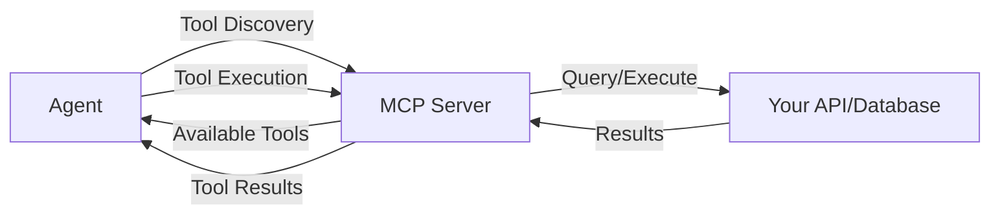

> Custom tools allow agents to interact with your APIs, databases, and services seamlessly through the Model Context Protocol (MCP), enabling domain-specific capabilities beyond built-in tools.

## Overview

The Custom Tools primitive extends agent capabilities by connecting external services, APIs, and databases through the Model Context Protocol (MCP). While agents come with powerful built-in tools for file operations, web browsing, and code execution, custom tools enable domain-specific functionality unique to your business needs.

Custom tools are essential for:

- **API Integration**: Connect agents to your internal and external APIs
- **Database Access**: Query and manipulate data in your databases
- **Business Logic**: Expose company-specific operations and workflows
- **Third-Party Services**: Integrate with CRM, payment processors, analytics platforms
- **Legacy Systems**: Bridge modern AI agents with existing infrastructure

<CardGroup cols={2}>
  <Card title="MCP Protocol" icon="plug">
    Built on the open Model Context Protocol standard for maximum compatibility and flexibility
  </Card>

  <Card title="Automatic Discovery" icon="wand-magic-sparkles">
    Agents automatically discover and use available tools based on task requirements
  </Card>

  <Card title="Type-Safe" icon="shield-check">
    Strongly-typed tool definitions ensure reliable agent-tool interactions
  </Card>

  <Card title="Dynamic Configuration" icon="sliders">
    Configure tools per-request for multi-tenant applications with different capabilities
  </Card>
</CardGroup>

## How Custom Tools Work

When you provide MCP server configurations to an agent:

1. **Registration**: Agent connects to specified MCP servers and discovers available tools
2. **Tool Discovery**: Each MCP server exposes its tool catalog with descriptions and parameters
3. **Automatic Selection**: Agent evaluates available tools and selects appropriate ones for the task
4. **Execution**: Agent calls tools with proper parameters and receives structured responses
5. **Integration**: Tool results are incorporated into the agent's reasoning and response
6. **Error Handling**: Failed tool calls are handled gracefully with retry logic

<Note>
**Protocol Standard**: Agentbase implements the full Model Context Protocol specification. Learn more at [modelcontextprotocol.io](https://modelcontextprotocol.io)
</Note>

## MCP Server Architecture

### Basic MCP Server Structure

An MCP server exposes tools through HTTP endpoints:



### MCP Server Requirements

Your MCP server must provide:

- **Tool Listing Endpoint**: Return available tools with descriptions and schemas
- **Tool Execution Endpoint**: Execute specific tools with provided parameters
- **Authentication Handling**: Support bearer tokens or OAuth for security
- **Error Responses**: Return structured error messages for failed operations
- **Type Definitions**: JSON Schema for parameters and return values

## Code Examples

### Basic Custom Tool Integration

<CodeGroup>

```typescript TypeScript
import { Agentbase } from '@agentbase/sdk';

const agentbase = new Agentbase({
  apiKey: process.env.AGENTBASE_API_KEY
});

// Connect to custom MCP server
const result = await agentbase.runAgent({
  message: "Get customer data for user ID 12345",
  mcpServers: [
    {
      serverName: "customer-api",
      serverUrl: "https://api.yourcompany.com/mcp"
    }
  ]
});

// Agent automatically discovers and uses available tools
```

```python Python
from agentbase import Agentbase

agentbase = Agentbase(api_key=os.environ['AGENTBASE_API_KEY'])

# Connect to custom MCP server
result = agentbase.run_agent(
    message="Get customer data for user ID 12345",
    mcp_servers=[
        {
            "serverName": "customer-api",
            "serverUrl": "https://api.yourcompany.com/mcp"
        }
    ]
)

# Agent automatically discovers and uses available tools
```

```bash cURL
curl -X POST https://api.agentbase.sh \
  -H "Authorization: Bearer $AGENTBASE_API_KEY" \
  -H "Content-Type: application/json" \
  -d '{
    "message": "Get customer data for user ID 12345",
    "mcp_servers": [
      {
        "serverName": "customer-api",
        "serverUrl": "https://api.yourcompany.com/mcp"
      }
    ]
  }'
```

</CodeGroup>

### Authentication with MCP Servers

<CodeGroup>

```typescript TypeScript
// Bearer token authentication
const resultBearer = await agentbase.runAgent({
  message: "Fetch sales data",
  mcpServers: [
    {
      serverName: "sales-api",
      serverUrl: "https://api.yourcompany.com/mcp",
      auth: {
        type: "bearer",
        token: process.env.API_TOKEN
      }
    }
  ]
});

// OAuth authentication
const resultOAuth = await agentbase.runAgent({
  message: "Access user profile",
  mcpServers: [
    {
      serverName: "user-service",
      serverUrl: "https://users.yourcompany.com/mcp",
      auth: {
        type: "oauth",
        oauth: {
          accessToken: process.env.OAUTH_ACCESS_TOKEN
        }
      }
    }
  ]
});
```

```python Python
# Bearer token authentication
result_bearer = agentbase.run_agent(
    message="Fetch sales data",
    mcp_servers=[
        {
            "serverName": "sales-api",
            "serverUrl": "https://api.yourcompany.com/mcp",
            "auth": {
                "type": "bearer",
                "token": os.environ['API_TOKEN']
            }
        }
    ]
)

# OAuth authentication
result_oauth = agentbase.run_agent(
    message="Access user profile",
    mcp_servers=[
        {
            "serverName": "user-service",
            "serverUrl": "https://users.yourcompany.com/mcp",
            "auth": {
                "type": "oauth",
                "oauth": {
                    "accessToken": os.environ['OAUTH_ACCESS_TOKEN']
                }
            }
        }
    ]
)
```

</CodeGroup>

### Multiple MCP Servers

<CodeGroup>

```typescript TypeScript
// Use multiple custom tools from different sources
const result = await agentbase.runAgent({
  message: "Create a customer order and charge their card",
  mcpServers: [
    {
      serverName: "crm-tools",
      serverUrl: "https://crm.yourcompany.com/mcp",
      auth: {
        type: "bearer",
        token: process.env.CRM_TOKEN
      }
    },
    {
      serverName: "payment-gateway",
      serverUrl: "https://payments.yourcompany.com/mcp",
      auth: {
        type: "bearer",
        token: process.env.PAYMENT_TOKEN
      }
    },
    {
      serverName: "inventory-system",
      serverUrl: "https://inventory.yourcompany.com/mcp"
    }
  ]
});

// Agent coordinates across multiple systems automatically
```

```python Python
# Use multiple custom tools from different sources
result = agentbase.run_agent(
    message="Create a customer order and charge their card",
    mcp_servers=[
        {
            "serverName": "crm-tools",
            "serverUrl": "https://crm.yourcompany.com/mcp",
            "auth": {
                "type": "bearer",
                "token": os.environ['CRM_TOKEN']
            }
        },
        {
            "serverName": "payment-gateway",
            "serverUrl": "https://payments.yourcompany.com/mcp",
            "auth": {
                "type": "bearer",
                "token": os.environ['PAYMENT_TOKEN']
            }
        },
        {
            "serverName": "inventory-system",
            "serverUrl": "https://inventory.yourcompany.com/mcp"
        }
    ]
)

# Agent coordinates across multiple systems automatically
```

</CodeGroup>

### Database Query Tools

<CodeGroup>

```typescript TypeScript
// Predefined database queries as tools
const result = await agentbase.runAgent({
  message: "Show me all active users from California",
  datastores: [
    {
      id: "ds_1234567890abcdef",
      name: "production-db"
    }
  ],
  queries: [
    {
      name: "getUsersByState",
      description: "Fetch users filtered by state",
      query: "SELECT * FROM users WHERE state = ? AND status = 'active'"
    },
    {
      name: "getUserById",
      description: "Fetch user details by their ID",
      query: "SELECT * FROM users WHERE id = ?"
    },
    {
      name: "getOrderHistory",
      description: "Get order history for a specific user",
      query: "SELECT * FROM orders WHERE user_id = ? ORDER BY created_at DESC"
    }
  ]
});
```

```python Python
# Predefined database queries as tools
result = agentbase.run_agent(
    message="Show me all active users from California",
    datastores=[
        {
            "id": "ds_1234567890abcdef",
            "name": "production-db"
        }
    ],
    queries=[
        {
            "name": "getUsersByState",
            "description": "Fetch users filtered by state",
            "query": "SELECT * FROM users WHERE state = ? AND status = 'active'"
        },
        {
            "name": "getUserById",
            "description": "Fetch user details by their ID",
            "query": "SELECT * FROM users WHERE id = ?"
        },
        {
            "name": "getOrderHistory",
            "description": "Get order history for a specific user",
            "query": "SELECT * FROM orders WHERE user_id = ? ORDER BY created_at DESC"
        }
    ]
)
```

</CodeGroup>

## Building an MCP Server

### MCP Server Implementation

Here's a complete example of an MCP server implementation:

<CodeGroup>

```typescript TypeScript (Express)
import express from 'express';
import { z } from 'zod';

const app = express();
app.use(express.json());

// Tool definitions
const tools = [
  {
    name: 'get_customer',
    description: 'Retrieve customer information by customer ID',
    inputSchema: {
      type: 'object',
      properties: {
        customer_id: {
          type: 'string',
          description: 'The unique customer identifier'
        }
      },
      required: ['customer_id']
    }
  },
  {
    name: 'create_order',
    description: 'Create a new order for a customer',
    inputSchema: {
      type: 'object',
      properties: {
        customer_id: { type: 'string' },
        items: {
          type: 'array',
          items: {
            type: 'object',
            properties: {
              product_id: { type: 'string' },
              quantity: { type: 'number' }
            }
          }
        },
        total_amount: { type: 'number' }
      },
      required: ['customer_id', 'items', 'total_amount']
    }
  }
];

// List available tools
app.post('/mcp/tools/list', (req, res) => {
  res.json({ tools });
});

// Execute tool
app.post('/mcp/tools/call', async (req, res) => {
  const { name, arguments: args } = req.body;

  try {
    switch (name) {
      case 'get_customer':
        const customer = await getCustomerFromDB(args.customer_id);
        res.json({ content: [{ type: 'text', text: JSON.stringify(customer) }] });
        break;

      case 'create_order':
        const order = await createOrderInDB(args);
        res.json({ content: [{ type: 'text', text: JSON.stringify(order) }] });
        break;

      default:
        res.status(404).json({ error: 'Tool not found' });
    }
  } catch (error) {
    res.status(500).json({ error: error.message });
  }
});

// Authentication middleware
app.use((req, res, next) => {
  const authHeader = req.headers.authorization;
  if (!authHeader || !authHeader.startsWith('Bearer ')) {
    return res.status(401).json({ error: 'Unauthorized' });
  }
  // Verify token
  next();
});

app.listen(3000, () => {
  console.log('MCP server running on port 3000');
});
```

```python Python (FastAPI)
from fastapi import FastAPI, HTTPException, Header
from pydantic import BaseModel
from typing import List, Dict, Any

app = FastAPI()

# Tool definitions
tools = [
    {
        "name": "get_customer",
        "description": "Retrieve customer information by customer ID",
        "inputSchema": {
            "type": "object",
            "properties": {
                "customer_id": {
                    "type": "string",
                    "description": "The unique customer identifier"
                }
            },
            "required": ["customer_id"]
        }
    },
    {
        "name": "create_order",
        "description": "Create a new order for a customer",
        "inputSchema": {
            "type": "object",
            "properties": {
                "customer_id": {"type": "string"},
                "items": {
                    "type": "array",
                    "items": {
                        "type": "object",
                        "properties": {
                            "product_id": {"type": "string"},
                            "quantity": {"type": "number"}
                        }
                    }
                },
                "total_amount": {"type": "number"}
            },
            "required": ["customer_id", "items", "total_amount"]
        }
    }
]

class ToolCallRequest(BaseModel):
    name: str
    arguments: Dict[str, Any]

# List available tools
@app.post("/mcp/tools/list")
async def list_tools():
    return {"tools": tools}

# Execute tool
@app.post("/mcp/tools/call")
async def call_tool(request: ToolCallRequest, authorization: str = Header(None)):
    if not authorization or not authorization.startswith("Bearer "):
        raise HTTPException(status_code=401, detail="Unauthorized")

    try:
        if request.name == "get_customer":
            customer = await get_customer_from_db(request.arguments["customer_id"])
            return {"content": [{"type": "text", "text": str(customer)}]}

        elif request.name == "create_order":
            order = await create_order_in_db(request.arguments)
            return {"content": [{"type": "text", "text": str(order)}]}

        else:
            raise HTTPException(status_code=404, detail="Tool not found")

    except Exception as e:
        raise HTTPException(status_code=500, detail=str(e))
```

</CodeGroup>

### Tool Schema Best Practices

<AccordionGroup>
  <Accordion title="Clear Tool Descriptions">
    ```json
    {
      "name": "search_products",
      "description": "Search the product catalog with filters. Returns products matching all specified criteria including name, category, price range, and availability status.",
      "inputSchema": {
        "type": "object",
        "properties": {
          "query": {
            "type": "string",
            "description": "Search terms to match against product names and descriptions"
          },
          "category": {
            "type": "string",
            "description": "Product category to filter by (e.g., 'electronics', 'clothing')"
          },
          "max_price": {
            "type": "number",
            "description": "Maximum price in USD"
          }
        }
      }
    }
    ```
  </Accordion>

  <Accordion title="Explicit Parameter Types">
    ```json
    {
      "name": "create_user",
      "inputSchema": {
        "type": "object",
        "properties": {
          "email": {
            "type": "string",
            "format": "email",
            "description": "User's email address (must be valid email format)"
          },
          "age": {
            "type": "integer",
            "minimum": 18,
            "maximum": 120,
            "description": "User's age (must be 18 or older)"
          },
          "role": {
            "type": "string",
            "enum": ["admin", "user", "guest"],
            "description": "User role in the system"
          }
        },
        "required": ["email", "role"]
      }
    }
    ```
  </Accordion>

  <Accordion title="Return Value Documentation">
    ```json
    {
      "name": "calculate_shipping",
      "description": "Calculate shipping cost and estimated delivery date",
      "inputSchema": { /* ... */ },
      "outputSchema": {
        "type": "object",
        "properties": {
          "cost": {
            "type": "number",
            "description": "Shipping cost in USD"
          },
          "currency": {
            "type": "string",
            "description": "Currency code (always USD)"
          },
          "estimated_days": {
            "type": "integer",
            "description": "Estimated delivery time in business days"
          },
          "carrier": {
            "type": "string",
            "description": "Shipping carrier name"
          }
        }
      }
    }
    ```
  </Accordion>
</AccordionGroup>

## Use Cases

### 1. CRM Integration

Connect agents to customer relationship management systems:

```typescript
const crmTools = await agentbase.runAgent({
  message: "Find all high-value customers who haven't been contacted in 30 days",
  mcpServers: [
    {
      serverName: "salesforce-mcp",
      serverUrl: "https://mcp.yourcompany.com/salesforce",
      auth: {
        type: "oauth",
        oauth: {
          accessToken: salesforceToken
        }
      }
    }
  ],
  system: "You are a sales assistant. Use CRM tools to find and prioritize customer outreach opportunities."
});

// Agent uses tools like:
// - search_customers(filters)
// - get_customer_interactions(customer_id)
// - get_customer_value(customer_id)
// - create_task(customer_id, description)
```

### 2. E-Commerce Operations

Automate order processing and inventory management:

```typescript
const ecommerce = await agentbase.runAgent({
  message: "Process pending orders and update inventory",
  mcpServers: [
    {
      serverName: "shopify-integration",
      serverUrl: "https://mcp.yourcompany.com/shopify"
    },
    {
      serverName: "inventory-system",
      serverUrl: "https://mcp.yourcompany.com/inventory"
    }
  ]
});

// Available tools:
// - get_pending_orders()
// - process_order(order_id)
// - check_inventory(product_id)
// - update_stock(product_id, quantity)
// - send_shipping_notification(order_id)
```

### 3. Financial Analysis

Query financial databases and perform calculations:

```typescript
const financial = await agentbase.runAgent({
  message: "Calculate Q4 revenue by region and compare to last year",
  datastores: [
    {
      id: "ds_financial_db",
      name: "financial-data"
    }
  ],
  queries: [
    {
      name: "getRevenueByRegion",
      description: "Get total revenue for a specific region and time period",
      query: `SELECT region, SUM(amount) as total_revenue
              FROM transactions
              WHERE date BETWEEN ? AND ? AND region = ?
              GROUP BY region`
    },
    {
      name: "getYearOverYearGrowth",
      description: "Calculate year-over-year revenue growth",
      query: `SELECT
                current.region,
                current.revenue as current_revenue,
                previous.revenue as previous_revenue,
                ((current.revenue - previous.revenue) / previous.revenue * 100) as growth_pct
              FROM revenue_summary current
              JOIN revenue_summary previous ON current.region = previous.region
              WHERE current.year = ? AND previous.year = ?`
    }
  ]
});
```

### 4. DevOps Automation

Integrate with infrastructure and deployment tools:

```typescript
const devops = await agentbase.runAgent({
  message: "Check production health and scale if needed",
  mcpServers: [
    {
      serverName: "kubernetes-api",
      serverUrl: "https://mcp.yourcompany.com/k8s",
      auth: {
        type: "bearer",
        token: k8sToken
      }
    },
    {
      serverName: "monitoring-tools",
      serverUrl: "https://mcp.yourcompany.com/monitoring"
    }
  ]
});

// Tools available:
// - get_pod_metrics(namespace, pod_name)
// - scale_deployment(deployment, replicas)
// - get_alerts(severity)
// - check_service_health(service_name)
// - restart_pod(pod_name)
```

### 5. Support Ticket Management

Automate customer support workflows:

```typescript
const support = await agentbase.runAgent({
  message: "Analyze open support tickets and prioritize urgent issues",
  mcpServers: [
    {
      serverName: "zendesk-integration",
      serverUrl: "https://mcp.yourcompany.com/zendesk"
    },
    {
      serverName: "customer-db",
      serverUrl: "https://mcp.yourcompany.com/customers"
    }
  ]
});

// Available tools:
// - get_open_tickets(status, priority)
// - get_ticket_details(ticket_id)
// - update_ticket(ticket_id, fields)
// - get_customer_tier(customer_id)
// - create_internal_note(ticket_id, note)
// - escalate_ticket(ticket_id, reason)
```

### 6. Content Management

Integrate with CMS and publishing platforms:

```typescript
const cms = await agentbase.runAgent({
  message: "Publish the blog post draft and schedule social media posts",
  mcpServers: [
    {
      serverName: "wordpress-api",
      serverUrl: "https://mcp.yourcompany.com/wordpress"
    },
    {
      serverName: "social-media",
      serverUrl: "https://mcp.yourcompany.com/social"
    }
  ]
});

// Tools:
// - create_post(title, content, category)
// - upload_media(file, alt_text)
// - schedule_post(post_id, publish_date)
// - create_social_post(platform, content, schedule)
```

## Best Practices

### Tool Design

<AccordionGroup>
  <Accordion title="Single Responsibility">
    ```json
    // Good: Focused, single-purpose tools
    {
      "name": "get_customer",
      "description": "Retrieve customer details by ID"
    }
    {
      "name": "update_customer_email",
      "description": "Update a customer's email address"
    }

    // Avoid: Kitchen-sink tools doing too much
    {
      "name": "manage_customer",
      "description": "Get, create, update, or delete customers"
    }
    ```
  </Accordion>

  <Accordion title="Descriptive Naming">
    ```json
    // Good: Clear, descriptive names
    "get_order_by_id"
    "calculate_shipping_cost"
    "send_password_reset_email"

    // Avoid: Vague or unclear names
    "fetch_data"
    "do_calculation"
    "send_email"
    ```
  </Accordion>

  <Accordion title="Idempotent Operations">
    ```typescript
    // Design tools to be safely repeatable
    {
      name: "create_or_update_user",
      description: "Create user if not exists, update if exists (idempotent)",
      // Uses upsert pattern
    }

    // Or provide clear state-checking tools
    {
      name: "user_exists",
      description: "Check if user exists"
    }
    {
      name: "create_user",
      description: "Create new user (fails if exists)"
    }
    ```
  </Accordion>

  <Accordion title="Error Handling">
    ```typescript
    // Return structured errors
    {
      "error": {
        "code": "CUSTOMER_NOT_FOUND",
        "message": "No customer found with ID: 12345",
        "details": {
          "customer_id": "12345",
          "suggestion": "Verify the customer ID and try again"
        }
      }
    }

    // Not just generic errors
    {
      "error": "An error occurred"
    }
    ```
  </Accordion>
</AccordionGroup>

### Security

<Warning>
**Authentication Required**: Always implement authentication on MCP servers. Never expose tools publicly without proper security measures.
</Warning>

```typescript
// Good: Per-user authentication with scoped access
const result = await agentbase.runAgent({
  message: "Get my account details",
  mcpServers: [
    {
      serverName: "user-api",
      serverUrl: "https://api.yourcompany.com/mcp",
      auth: {
        type: "bearer",
        token: userSpecificToken  // User-scoped token
      }
    }
  ]
});

// Server validates token and returns only user's data
```

<AccordionGroup>
  <Accordion title="Input Validation">
    ```typescript
    // Always validate and sanitize inputs
    app.post('/mcp/tools/call', async (req, res) => {
      const { name, arguments: args } = req.body;

      // Validate input
      if (name === 'get_customer') {
        if (!args.customer_id || typeof args.customer_id !== 'string') {
          return res.status(400).json({
            error: 'Invalid customer_id parameter'
          });
        }

        // Sanitize input to prevent SQL injection
        const customerId = sanitize(args.customer_id);

        const customer = await db.query(
          'SELECT * FROM customers WHERE id = ?',
          [customerId]  // Parameterized query
        );

        res.json({ content: [{ type: 'text', text: JSON.stringify(customer) }] });
      }
    });
    ```
  </Accordion>

  <Accordion title="Rate Limiting">
    ```typescript
    import rateLimit from 'express-rate-limit';

    // Implement rate limiting on MCP endpoints
    const limiter = rateLimit({
      windowMs: 15 * 60 * 1000, // 15 minutes
      max: 100, // Limit each token to 100 requests per windowMs
      message: 'Too many requests, please try again later'
    });

    app.use('/mcp', limiter);
    ```
  </Accordion>

  <Accordion title="Audit Logging">
    ```typescript
    // Log all tool executions for audit trail
    app.post('/mcp/tools/call', async (req, res) => {
      const { name, arguments: args } = req.body;
      const userId = extractUserFromToken(req.headers.authorization);

      // Log the request
      await auditLog.create({
        userId,
        toolName: name,
        parameters: args,
        timestamp: new Date(),
        ipAddress: req.ip
      });

      // Execute tool...
    });
    ```
  </Accordion>
</AccordionGroup>

### Performance

<CardGroup cols={2}>
  <Card title="Caching" icon="database">
    Cache frequently accessed data to reduce load on backend systems
  </Card>

  <Card title="Pagination" icon="list">
    Return paginated results for large datasets instead of everything at once
  </Card>

  <Card title="Async Operations" icon="clock">
    Use async patterns for long-running operations with status checking
  </Card>

  <Card title="Connection Pooling" icon="server">
    Reuse database connections instead of creating new ones per request
  </Card>
</CardGroup>

```typescript
// Implement caching for expensive operations
import NodeCache from 'node-cache';
const cache = new NodeCache({ stdTTL: 300 }); // 5 minute TTL

app.post('/mcp/tools/call', async (req, res) => {
  const { name, arguments: args } = req.body;

  if (name === 'get_product_catalog') {
    // Check cache first
    const cacheKey = `catalog_${args.category}`;
    const cached = cache.get(cacheKey);

    if (cached) {
      return res.json({ content: [{ type: 'text', text: cached }] });
    }

    // Fetch from database
    const catalog = await getProductCatalog(args.category);

    // Store in cache
    cache.set(cacheKey, JSON.stringify(catalog));

    res.json({ content: [{ type: 'text', text: JSON.stringify(catalog) }] });
  }
});
```

## Integration with Other Primitives

### With Prompts

Guide agents on when and how to use custom tools:

```typescript
const result = await agentbase.runAgent({
  message: "Help customer with order status",
  system: `You are a customer support agent.

When helping with orders:
1. Use get_order_status tool to check current status
2. Use get_tracking_info if order is shipped
3. Use estimate_delivery for pending orders
4. Always provide tracking numbers when available`,
  mcpServers: [
    {
      serverName: "order-tools",
      serverUrl: "https://api.yourcompany.com/mcp"
    }
  ]
});
```

Learn more: [Prompts Primitive](/primitives/essentials/prompts)

### With Rules

Enforce constraints on tool usage:

```typescript
const result = await agentbase.runAgent({
  message: "Update customer record",
  mcpServers: [
    {
      serverName: "customer-api",
      serverUrl: "https://api.yourcompany.com/mcp"
    }
  ],
  rules: [
    "Always verify customer identity before accessing account data",
    "Never update payment information without explicit customer confirmation",
    "Log all customer data access for audit purposes"
  ]
});
```

Learn more: [Rules](/build/rules)

### With Multi-Agent Systems

Different agents with different tool access:

```typescript
const result = await agentbase.runAgent({
  message: "I need help",
  system: "You are a routing agent. Transfer to appropriate specialist.",
  agents: [
    {
      name: "Order Support",
      description: "Handles order-related questions",
      // Order support agent gets order tools
    },
    {
      name: "Technical Support",
      description: "Handles technical issues",
      // Technical support gets different tools
    }
  ]
});
```

Learn more: [Multi-Agent Primitive](/primitives/essentials/multi-agents)

### With Datastores

Combine database access with custom business logic:

```typescript
const result = await agentbase.runAgent({
  message: "Generate sales report and email to team",
  datastores: [
    {
      id: "ds_sales_db",
      name: "sales-data"
    }
  ],
  queries: [
    {
      name: "getSalesData",
      description: "Get sales for date range",
      query: "SELECT * FROM sales WHERE date BETWEEN ? AND ?"
    }
  ],
  mcpServers: [
    {
      serverName: "email-service",
      serverUrl: "https://api.yourcompany.com/email"
    }
  ]
});

// Agent can query database AND send emails
```

## Performance Considerations

### Tool Discovery Overhead

- **First Request**: Agent discovers all available tools (~100-500ms)
- **Subsequent Requests**: Tool catalog cached within session
- **Optimization**: Minimize number of MCP servers when possible

```typescript
// Efficient: One MCP server with all related tools
mcpServers: [
  {
    serverName: "crm-suite",
    serverUrl: "https://api.company.com/mcp"
    // Contains: customer tools, order tools, analytics tools
  }
]

// Less efficient: Multiple servers for related functionality
mcpServers: [
  { serverName: "customers", serverUrl: "https://api.company.com/customers" },
  { serverName: "orders", serverUrl: "https://api.company.com/orders" },
  { serverName: "analytics", serverUrl: "https://api.company.com/analytics" }
]
```

### Tool Execution Time

Monitor and optimize tool response times:

```typescript
// Add timeout handling
app.post('/mcp/tools/call', async (req, res) => {
  const timeout = setTimeout(() => {
    res.status(408).json({
      error: 'Tool execution timeout',
      message: 'Operation took longer than 30 seconds'
    });
  }, 30000);

  try {
    const result = await executeTool(req.body);
    clearTimeout(timeout);
    res.json(result);
  } catch (error) {
    clearTimeout(timeout);
    res.status(500).json({ error: error.message });
  }
});
```

### Network Latency

<Tip>
**Co-location**: Deploy MCP servers in the same region as Agentbase for lowest latency. Cross-region calls can add 50-200ms per tool execution.
</Tip>

## Troubleshooting

<AccordionGroup>
  <Accordion title="Agent Not Using Custom Tools">
    **Problem**: Agent doesn't call your custom tools

    **Solutions**:
    - Improve tool descriptions to be more specific
    - Add guidance in system prompt about when to use tools
    - Verify MCP server is accessible and returning tool list
    - Check authentication is configured correctly
    - Ensure tool parameters match task requirements

    ```typescript
    // Add explicit guidance
    system: `You are a customer service agent.

    Available tools:
    - get_customer(id): Always use this to fetch customer details
    - get_order(id): Use this to check order status
    - create_ticket(details): Use this to escalate issues

    Always retrieve customer information before helping them.`
    ```
  </Accordion>

  <Accordion title="Tool Authentication Failures">
    **Problem**: Tools returning 401/403 errors

    **Solutions**:
    - Verify auth token is valid and not expired
    - Check token has required permissions
    - Ensure auth type matches server expectations
    - Test authentication with direct API call

    ```typescript
    // Debug authentication
    const result = await agentbase.runAgent({
      message: "Test connection",
      mcpServers: [
        {
          serverName: "test",
          serverUrl: "https://api.company.com/mcp",
          auth: {
            type: "bearer",
            token: testToken
          }
        }
      ]
    });

    // Check agent_tool_response events for auth errors
    ```
  </Accordion>

  <Accordion title="Slow Tool Execution">
    **Problem**: Tools taking too long to execute

    **Solutions**:
    - Add caching for frequently accessed data
    - Optimize database queries
    - Implement pagination for large datasets
    - Use connection pooling
    - Consider async operations for long tasks

    ```typescript
    // Monitor tool performance
    app.post('/mcp/tools/call', async (req, res) => {
      const start = Date.now();

      const result = await executeTool(req.body);

      const duration = Date.now() - start;
      console.log(`Tool ${req.body.name} executed in ${duration}ms`);

      if (duration > 5000) {
        console.warn('Slow tool execution detected');
      }

      res.json(result);
    });
    ```
  </Accordion>

  <Accordion title="Tool Errors Not Handled Gracefully">
    **Problem**: Agent gets confused by tool errors

    **Solutions**:
    - Return structured error messages
    - Include helpful error codes
    - Provide suggested fixes in error response
    - Document error scenarios in tool description

    ```typescript
    // Return helpful errors
    if (!customer) {
      return res.json({
        content: [{
          type: 'text',
          text: JSON.stringify({
            error: {
              code: 'CUSTOMER_NOT_FOUND',
              message: `No customer found with ID: ${customerId}`,
              suggestion: 'Verify the customer ID or search by email instead',
              available_actions: ['search_customer_by_email', 'list_recent_customers']
            }
          })
        }]
      });
    }
    ```
  </Accordion>
</AccordionGroup>

## Related Primitives

<CardGroup cols={2}>
  <Card title="Prompts" icon="message-bot" href="/primitives/essentials/prompts">
    Guide agents on when and how to use tools
  </Card>

  <Card title="Rules" icon="shield" href="/build/rules">
    Enforce constraints on tool usage
  </Card>

  <Card title="Multi-Agent" icon="users" href="/primitives/essentials/multi-agents">
    Give different agents different tool access
  </Card>

  <Card title="Datastores" icon="database" href="/api/create-datastore">
    Database integration for custom queries
  </Card>
</CardGroup>

## Additional Resources

<CardGroup cols={3}>
  <Card title="MCP Protocol" icon="book" href="https://modelcontextprotocol.io">
    Official Model Context Protocol documentation
  </Card>

  <Card title="API Reference" icon="code" href="/api/run-agent">
    Complete MCP server configuration options
  </Card>

  <Card title="Built-in Tools" icon="hammer" href="/build/tools">
    Learn about Agentbase's built-in tools
  </Card>
</CardGroup>

<Tip>
**Remember**: Custom tools are most powerful when they expose domain-specific operations that agents can't accomplish with built-in tools alone. Focus on business logic unique to your application.
</Tip>
