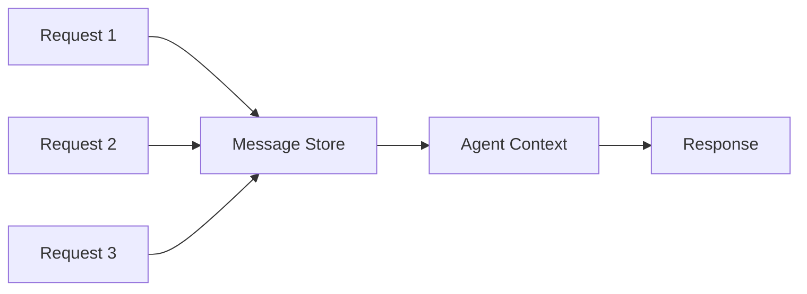

> States enable agents to maintain context, remember past interactions, and build upon previous work across multiple requests and sessions.

## Overview

The States primitive represents the agent's persistent memory and context management system. While sessions provide the container for conversations, states determine what information persists and how agents maintain context across interactions. This enables sophisticated workflows where agents can:

- **Remember Context**: Maintain conversation history and relevant information across requests
- **Build Incrementally**: Continue work from previous steps without starting over
- **Track Progress**: Keep track of multi-step workflows and their current state
- **Share Knowledge**: Make information available across different parts of a workflow
- **Maintain Variables**: Store and retrieve data throughout the agent's execution

<CardGroup cols={2}>
  <Card title="Automatic Persistence" icon="floppy-disk">
    Message history persists automatically at no cost for all conversations
  </Card>

  <Card title="Environment State" icon="box">
    Files, installed packages, and system state persist within session sandboxes
  </Card>

  <Card title="Session-Scoped" icon="link">
    Each session maintains its own isolated state and context
  </Card>

  <Card title="Incremental Building" icon="layer-group">
    Agents build upon previous work without repeating completed steps
  </Card>
</CardGroup>

## How State Works in Agentbase

Agentbase implements a two-tier state management model:

### 1. Conversational State (Message History)

**Automatic & Free**: Every message in a session is automatically persisted:



- **What's Stored**: All user messages, agent responses, tool calls, and their results
- **Cost**: Zero - message history is always free
- **Retention**: Persists for the lifetime of the session
- **Access**: Automatically included in agent context for subsequent requests

### 2. Computational State (Environment)

**On-Demand Creation**: The sandbox environment state when agents perform operations:

- **Files Created**: All files written persist in the session sandbox
- **Packages Installed**: Dependencies remain installed across requests
- **System State**: Environment variables, running processes, directory structure
- **Browser State**: Cookies, local storage, authentication sessions

<Note>
**Session Continuity**: Both conversational and computational state are tied to session IDs. Reuse the same session ID to maintain all context.
</Note>

## Code Examples

### Basic State Persistence

<CodeGroup>

```typescript TypeScript
import { Agentbase } from '@agentbase/sdk';

const agentbase = new Agentbase({
  apiKey: process.env.AGENTBASE_API_KEY
});

// First request - creates state
const step1 = await agentbase.runAgent({
  message: "Create a file called data.json with some sample data"
});

console.log('Session ID:', step1.session);
// Output: Session ID: agent_session_abc123...

// Second request - uses existing state
const step2 = await agentbase.runAgent({
  message: "Read the data.json file and summarize its contents",
  session: step1.session  // Reuse session = reuse state
});

// The file still exists! Agent can read it.
```

```python Python
from agentbase import Agentbase

agentbase = Agentbase(api_key=os.environ['AGENTBASE_API_KEY'])

# First request - creates state
step1 = agentbase.run_agent(
    message="Create a file called data.json with some sample data"
)

print(f"Session ID: {step1.session}")
# Output: Session ID: agent_session_abc123...

# Second request - uses existing state
step2 = agentbase.run_agent(
    message="Read the data.json file and summarize its contents",
    session=step1.session  # Reuse session = reuse state
)

# The file still exists! Agent can read it.
```

```bash cURL
# First request - creates state
curl -X POST https://api.agentbase.sh \
  -H "Authorization: Bearer $AGENTBASE_API_KEY" \
  -H "Content-Type: application/json" \
  -d '{
    "message": "Create a file called data.json with some sample data"
  }'

# Response includes session ID: agent_session_abc123

# Second request - uses existing state
curl -X POST "https://api.agentbase.sh?session=agent_session_abc123" \
  -H "Authorization: Bearer $AGENTBASE_API_KEY" \
  -H "Content-Type: application/json" \
  -d '{
    "message": "Read the data.json file and summarize its contents"
  }'

# The file persists in the session
```

</CodeGroup>

### Multi-Step Workflow with State

<CodeGroup>

```typescript TypeScript
// Step 1: Setup environment
const setup = await agentbase.runAgent({
  message: "Install pandas and numpy"
});

// Step 2: Process data (packages still installed)
const process = await agentbase.runAgent({
  message: "Create a Python script to process sales.csv",
  session: setup.session
});

// Step 3: Analyze (script and packages still available)
const analyze = await agentbase.runAgent({
  message: "Run the script and show the analysis",
  session: setup.session
});

// Step 4: Visualize (all previous work available)
const visualize = await agentbase.runAgent({
  message: "Create a chart from the analysis results",
  session: setup.session
});

// Each step builds on previous state
```

```python Python
# Step 1: Setup environment
setup = agentbase.run_agent(
    message="Install pandas and numpy"
)

# Step 2: Process data (packages still installed)
process = agentbase.run_agent(
    message="Create a Python script to process sales.csv",
    session=setup.session
)

# Step 3: Analyze (script and packages still available)
analyze = agentbase.run_agent(
    message="Run the script and show the analysis",
    session=setup.session
)

# Step 4: Visualize (all previous work available)
visualize = agentbase.run_agent(
    message="Create a chart from the analysis results",
    session=setup.session
)

# Each step builds on previous state
```

</CodeGroup>

### Conversational Context

<CodeGroup>

```typescript TypeScript
// Agent remembers conversation history
const result1 = await agentbase.runAgent({
  message: "My name is Alice and I work at TechCorp"
});

const result2 = await agentbase.runAgent({
  message: "What's my name?",
  session: result1.session
});
// Agent responds: "Your name is Alice"

const result3 = await agentbase.runAgent({
  message: "Where do I work?",
  session: result1.session
});
// Agent responds: "You work at TechCorp"

// All previous messages are in context
```

```python Python
# Agent remembers conversation history
result1 = agentbase.run_agent(
    message="My name is Alice and I work at TechCorp"
)

result2 = agentbase.run_agent(
    message="What's my name?",
    session=result1.session
)
# Agent responds: "Your name is Alice"

result3 = agentbase.run_agent(
    message="Where do I work?",
    session=result1.session
)
# Agent responds: "You work at TechCorp"

# All previous messages are in context
```

</CodeGroup>

### Stateful Development Workflow

<CodeGroup>

```typescript TypeScript
// Create a complete development workflow with persistent state
async function developmentWorkflow() {
  // Initialize project
  const init = await agentbase.runAgent({
    message: "Create a new Node.js project with package.json"
  });

  const sessionId = init.session;

  // Install dependencies
  await agentbase.runAgent({
    message: "Install express, dotenv, and nodemon",
    session: sessionId
  });

  // Create application
  await agentbase.runAgent({
    message: "Create a basic Express server in src/index.js",
    session: sessionId
  });

  // Add features
  await agentbase.runAgent({
    message: "Add a /health endpoint to the server",
    session: sessionId
  });

  // Test
  const test = await agentbase.runAgent({
    message: "Start the server and test the health endpoint",
    session: sessionId
  });

  return test;
}
```

```python Python
# Create a complete development workflow with persistent state
async def development_workflow():
    # Initialize project
    init = agentbase.run_agent(
        message="Create a new Node.js project with package.json"
    )

    session_id = init.session

    # Install dependencies
    agentbase.run_agent(
        message="Install express, dotenv, and nodemon",
        session=session_id
    )

    # Create application
    agentbase.run_agent(
        message="Create a basic Express server in src/index.js",
        session=session_id
    )

    # Add features
    agentbase.run_agent(
        message="Add a /health endpoint to the server",
        session=session_id
    )

    # Test
    test = agentbase.run_agent(
        message="Start the server and test the health endpoint",
        session=session_id
    )

    return test
```

</CodeGroup>

## State Lifecycle

### State Creation

State is created automatically on the first request in a session:

```typescript
// No session ID = new session = new state
const result = await agentbase.runAgent({
  message: "Start a new project"
});

// Fresh state:
// - Empty message history
// - Clean file system
// - No installed packages
// - Default environment
```

### State Persistence

State persists throughout the session:

```typescript
// Same session = same state
const continued = await agentbase.runAgent({
  message: "Continue from where we left off",
  session: existingSessionId
});

// Preserved state:
// - All previous messages
// - All created files
// - All installed packages
// - Environment variables
// - Working directory
```

### State Pause and Resume

After 5 minutes of inactivity, the computational environment pauses:

```typescript
// Agent pauses after 5 minutes of no requests
// ... 10 minutes pass ...

// Resume automatically on next request
const resumed = await agentbase.runAgent({
  message: "Let's continue",
  session: pausedSessionId
});

// State restored:
// - Message history: ✓ intact
// - Files: ✓ intact
// - Packages: ✓ intact
// - Running processes: ✗ stopped (need restart)
```

### State Cleanup

Sessions eventually expire after extended inactivity:

```typescript
// After session expires, state is cleaned up
// Attempting to use expired session creates new session

try {
  const result = await agentbase.runAgent({
    message: "Resume old session",
    session: veryOldSessionId
  });
} catch (error) {
  if (error.code === 'SESSION_EXPIRED') {
    // Start fresh
    const newResult = await agentbase.runAgent({
      message: "Start new session"
    });
  }
}
```

## Use Cases

### 1. Iterative Development

Build software incrementally:

```typescript
async function iterativeDevelopment() {
  // Session for the entire development process
  const session = (await agentbase.runAgent({
    message: "Create a Python web scraper project structure"
  })).session;

  // Each step builds on the previous
  await agentbase.runAgent({
    message: "Install beautifulsoup4 and requests",
    session
  });

  await agentbase.runAgent({
    message: "Create scraper.py with basic scraping logic",
    session
  });

  await agentbase.runAgent({
    message: "Add error handling to the scraper",
    session
  });

  await agentbase.runAgent({
    message: "Create tests for the scraper",
    session
  });

  const final = await agentbase.runAgent({
    message: "Run the tests and fix any issues",
    session
  });

  return final;
}
```

### 2. Data Analysis Pipeline

Process data through multiple stages:

```typescript
async function analysisPipeline(dataUrl: string) {
  // Start pipeline
  const download = await agentbase.runAgent({
    message: `Download data from ${dataUrl}`
  });

  const sessionId = download.session;

  // Clean data
  await agentbase.runAgent({
    message: "Clean the data: remove duplicates, handle missing values",
    session: sessionId
  });

  // Transform
  await agentbase.runAgent({
    message: "Create derived features and aggregate by category",
    session: sessionId
  });

  // Analyze
  await agentbase.runAgent({
    message: "Perform statistical analysis and identify trends",
    session: sessionId
  });

  // Visualize
  const final = await agentbase.runAgent({
    message: "Create visualizations and save as report.pdf",
    session: sessionId
  });

  return final;
}
```

### 3. Long-Running Support Sessions

Maintain context throughout customer interactions:

```typescript
async function customerSupportSession(customerId: string) {
  // Lookup customer
  const lookup = await agentbase.runAgent({
    message: `Look up customer ${customerId} details`,
    system: "You are a customer support agent"
  });

  const sessionId = lookup.session;

  // Throughout the conversation, agent remembers everything
  const response1 = await agentbase.runAgent({
    message: "Customer: I can't access my account",
    session: sessionId
  });

  const response2 = await agentbase.runAgent({
    message: "Customer: I've tried resetting my password",
    session: sessionId
    // Agent remembers the original issue and customer details
  });

  const response3 = await agentbase.runAgent({
    message: "Customer: That worked, thanks!",
    session: sessionId
    // Agent knows what solution was provided
  });

  return sessionId; // Store for potential follow-up
}
```

### 4. Research and Compilation

Gather information progressively:

```typescript
async function researchProject(topic: string) {
  // Start research
  const init = await agentbase.runAgent({
    message: `Research ${topic} and create a document with findings`
  });

  const sessionId = init.session;

  // Add more information
  await agentbase.runAgent({
    message: "Search for recent developments in 2024",
    session: sessionId
    // Adds to existing document
  });

  await agentbase.runAgent({
    message: "Find case studies and real-world examples",
    session: sessionId
    // Appends to document
  });

  await agentbase.runAgent({
    message: "Add statistics and data points",
    session: sessionId
    // Enhances existing content
  });

  const final = await agentbase.runAgent({
    message: "Organize all findings into a structured report",
    session: sessionId
    // Works with all accumulated information
  });

  return final;
}
```

### 5. Testing and Debugging

Iteratively debug and test code:

```typescript
async function debugWorkflow() {
  // Create buggy code
  const code = await agentbase.runAgent({
    message: "Create a Python script that processes user data"
  });

  const sessionId = code.session;

  // Test it
  const test1 = await agentbase.runAgent({
    message: "Run the script with test data",
    session: sessionId
  });

  // Fix issues found
  await agentbase.runAgent({
    message: "Fix the KeyError in the script",
    session: sessionId
    // Script still exists, just modify it
  });

  // Test again
  const test2 = await agentbase.runAgent({
    message: "Run the script again",
    session: sessionId
  });

  // Add more test cases
  const final = await agentbase.runAgent({
    message: "Test edge cases: empty input, large dataset",
    session: sessionId
  });

  return final;
}
```

### 6. Document Generation

Build documents incrementally:

```typescript
async function createProposal(clientName: string) {
  // Start document
  const init = await agentbase.runAgent({
    message: `Create a project proposal document for ${clientName}`
  });

  const sessionId = init.session;

  // Add sections progressively
  await agentbase.runAgent({
    message: "Add executive summary section",
    session: sessionId
  });

  await agentbase.runAgent({
    message: "Add scope of work with 5 deliverables",
    session: sessionId
  });

  await agentbase.runAgent({
    message: "Add timeline and milestones",
    session: sessionId
  });

  await agentbase.runAgent({
    message: "Add pricing breakdown",
    session: sessionId
  });

  const final = await agentbase.runAgent({
    message: "Format as PDF and create summary slide deck",
    session: sessionId
  });

  return final;
}
```

## Best Practices

### Session Management

<AccordionGroup>
  <Accordion title="Store Session IDs for Long-Running Workflows">
    ```typescript
    // Store session ID in your database
    async function startWorkflow(userId: string, workflowType: string) {
      const result = await agentbase.runAgent({
        message: "Initialize workflow"
      });

      // Save for later use
      await db.workflows.create({
        userId,
        workflowType,
        sessionId: result.session,
        status: 'in_progress',
        createdAt: new Date()
      });

      return result.session;
    }

    // Resume later
    async function continueWorkflow(workflowId: string, message: string) {
      const workflow = await db.workflows.findById(workflowId);

      return await agentbase.runAgent({
        message,
        session: workflow.sessionId
      });
    }
    ```
  </Accordion>

  <Accordion title="Use Separate Sessions for Independent Tasks">
    ```typescript
    // Good: Separate sessions for unrelated tasks
    const customerAnalysis = await agentbase.runAgent({
      message: "Analyze customer churn data"
      // New session, clean state
    });

    const contentGeneration = await agentbase.runAgent({
      message: "Generate marketing content"
      // Different session, different state
    });

    // Avoid: Mixing unrelated work in one session
    const mixed = await agentbase.runAgent({
      message: "Analyze customer data"
    });

    await agentbase.runAgent({
      message: "Now write marketing content",
      session: mixed.session
      // Confusing context with unrelated previous work
    });
    ```
  </Accordion>

  <Accordion title="Clean Up Temporary State">
    ```typescript
    // Clean up large files to manage disk usage
    const analysis = await agentbase.runAgent({
      message: "Process large_dataset.csv and analyze"
    });

    const sessionId = analysis.session;

    // Continue with analysis results
    await agentbase.runAgent({
      message: "Create summary report",
      session: sessionId
    });

    // Clean up large files no longer needed
    await agentbase.runAgent({
      message: "Delete large_dataset.csv and any temporary files",
      session: sessionId
    });
    ```
  </Accordion>
</AccordionGroup>

### State Organization

<Tip>
**Modular State**: Organize files and data logically within sessions for easier navigation and management.
</Tip>

```typescript
// Well-organized state structure
const project = await agentbase.runAgent({
  message: `Create project structure:
  - src/ (source code)
  - tests/ (test files)
  - data/ (data files)
  - output/ (results and reports)
  - docs/ (documentation)`
});

// Use throughout workflow
await agentbase.runAgent({
  message: "Create analysis script in src/analyze.py",
  session: project.session
});

await agentbase.runAgent({
  message: "Save results to output/results.json",
  session: project.session
});
```

### State Recovery

<AccordionGroup>
  <Accordion title="Handle Session Expiration">
    ```typescript
    async function safeResume(sessionId: string, message: string) {
      try {
        return await agentbase.runAgent({
          message,
          session: sessionId
        });
      } catch (error) {
        if (error.code === 'SESSION_NOT_FOUND') {
          console.warn('Session expired, starting fresh');
          // Either start new session or restore from checkpoint
          return await agentbase.runAgent({
            message: `Resume workflow: ${message}`,
            system: "Previous session expired, recreate necessary state"
          });
        }
        throw error;
      }
    }
    ```
  </Accordion>

  <Accordion title="Create State Checkpoints">
    ```typescript
    // Save important state externally for recovery
    async function workflowWithCheckpoints() {
      const result = await agentbase.runAgent({
        message: "Process data and create report"
      });

      const sessionId = result.session;

      // Create checkpoint - extract important state
      const checkpoint = await agentbase.runAgent({
        message: "List all created files and their purposes",
        session: sessionId
      });

      // Store checkpoint externally
      await saveCheckpoint({
        sessionId,
        timestamp: new Date(),
        files: checkpoint.message,
        context: "Data processing workflow"
      });

      return result;
    }
    ```
  </Accordion>
</AccordionGroup>

### Performance Optimization

<CardGroup cols={2}>
  <Card title="Reuse Sessions" icon="recycle">
    Minimize cold starts by reusing sessions for related work
  </Card>

  <Card title="Batch Operations" icon="layer-group">
    Group related tasks in single session to leverage state
  </Card>

  <Card title="Clean State" icon="broom">
    Remove unused files to stay within disk limits
  </Card>

  <Card title="Preload Common" icon="download">
    Install common dependencies once per session
  </Card>
</CardGroup>

## Integration with Other Primitives

### With Sessions

Sessions provide the container for state:

```typescript
// Session = container, State = contents
const session1 = await agentbase.runAgent({
  message: "Task A"
});
// Session 1 has its own state

const session2 = await agentbase.runAgent({
  message: "Task B"
});
// Session 2 has completely separate state
```

Learn more: [Sessions Primitive](/primitives/essentials/sessions)

### With Sandbox

State exists within sandbox boundaries:

```typescript
// Each sandbox has isolated state
const result = await agentbase.runAgent({
  message: "Create sensitive_data.txt"
});

// File exists only in this sandbox/session
// Other sessions cannot access it
```

Learn more: [Sandbox Primitive](/primitives/environment/sandbox)

### With Computer Environment

System state persists across requests:

```typescript
// Install once, use multiple times
const setup = await agentbase.runAgent({
  message: "Install tensorflow and keras"
});

// Packages still installed
const train = await agentbase.runAgent({
  message: "Train a model using tensorflow",
  session: setup.session
});

// Model file persists
const evaluate = await agentbase.runAgent({
  message: "Load and evaluate the trained model",
  session: setup.session
});
```

Learn more: [Computer Primitive](/primitives/environment/computer)

### With File System

Files are the primary persistent state:

```typescript
// Create files that persist
const files = await agentbase.runAgent({
  message: "Create config.json, data.csv, and script.py"
});

// All files still exist
const modify = await agentbase.runAgent({
  message: "Update config.json with new settings",
  session: files.session
});

// Read any file from the session
const read = await agentbase.runAgent({
  message: "Show contents of all three files",
  session: files.session
});
```

Learn more: [File System Primitive](/primitives/environment/file-system)

## Performance Considerations

### State Size

Monitor state size to avoid hitting limits:

- **Message History**: Unlimited messages, but very long histories may impact performance
- **File Storage**: 10GB per session limit
- **Memory Usage**: 2-4GB depending on mode

```typescript
// Check disk usage
const check = await agentbase.runAgent({
  message: "Show disk usage with du -sh",
  session: existingSession
});

// Clean up if needed
if (usageHigh) {
  await agentbase.runAgent({
    message: "Delete files in /tmp and other temporary directories",
    session: existingSession
  });
}
```

### Context Window Management

Very long message histories may need summarization:

```typescript
// For very long sessions, periodically summarize
const summary = await agentbase.runAgent({
  message: "Summarize our conversation so far and key decisions made",
  session: longSession
});

// Store summary externally, potentially start new session
// with summary as context
```

### Cold Start vs. Warm Start

- **Cold Start** (new session): ~2-5 seconds overhead
- **Warm Start** (existing session): Instant, state already loaded
- **Resumed** (paused session): ~1-2 seconds to resume

```typescript
// Optimize by reusing sessions
const sessionId = await initializeOnce();

// All subsequent requests are warm starts
for (const task of tasks) {
  await agentbase.runAgent({
    message: task,
    session: sessionId  // Fast, state already loaded
  });
}
```

## Troubleshooting

<AccordionGroup>
  <Accordion title="State Not Persisting">
    **Problem**: Changes don't persist between requests

    **Solution**: Verify you're using the same session ID
    ```typescript
    // Wrong: Not passing session ID
    const step1 = await agentbase.runAgent({
      message: "Create file.txt"
    });

    const step2 = await agentbase.runAgent({
      message: "Read file.txt"
      // Missing session: step1.session
    });

    // Correct: Passing session ID
    const step2Fixed = await agentbase.runAgent({
      message: "Read file.txt",
      session: step1.session  // ✓ Reuses state
    });
    ```
  </Accordion>

  <Accordion title="Session Expired">
    **Problem**: Session no longer available

    **Solution**: Implement expiration handling and state recovery
    ```typescript
    async function robustWorkflow(maybeExpiredSession: string) {
      try {
        return await agentbase.runAgent({
          message: "Continue work",
          session: maybeExpiredSession
        });
      } catch (error) {
        if (error.code === 'SESSION_NOT_FOUND') {
          // Restore from checkpoint or start fresh
          const checkpoint = await loadCheckpoint(maybeExpiredSession);
          return await agentbase.runAgent({
            message: `Resume: ${checkpoint.description}`,
            system: `Context: ${checkpoint.context}`
          });
        }
        throw error;
      }
    }
    ```
  </Accordion>

  <Accordion title="Disk Space Exceeded">
    **Problem**: Hit 10GB storage limit

    **Solution**: Clean up large files regularly
    ```typescript
    // Monitor disk usage
    const usage = await agentbase.runAgent({
      message: "Check disk usage and list large files",
      session: existingSession
    });

    // Clean up
    await agentbase.runAgent({
      message: "Delete temporary files and large downloads",
      session: existingSession
    });
    ```
  </Accordion>

  <Accordion title="Conflicting State">
    **Problem**: Previous state interfering with new tasks

    **Solution**: Start new session for unrelated work
    ```typescript
    // Don't mix unrelated tasks
    // Instead of:
    const mixed = await agentbase.runAgent({
      message: "Different task",
      session: existingSession  // May have conflicting state
    });

    // Do this:
    const clean = await agentbase.runAgent({
      message: "Different task"
      // New session, clean state
    });
    ```
  </Accordion>
</AccordionGroup>

## Advanced Patterns

### State Snapshots

Create snapshots of important state:

```typescript
async function createSnapshot(sessionId: string) {
  // List all important state
  const state = await agentbase.runAgent({
    message: `Create a snapshot:
    1. List all files in project directory
    2. Export environment variables
    3. List installed packages
    4. Summarize current progress`,
    session: sessionId
  });

  // Store snapshot externally
  return {
    sessionId,
    timestamp: new Date(),
    snapshot: state.message
  };
}

// Restore from snapshot
async function restoreFromSnapshot(snapshot: any) {
  return await agentbase.runAgent({
    message: `Restore state: ${snapshot.snapshot}`,
    system: "Recreate the described environment and files"
  });
}
```

### State Migration

Move state between sessions:

```typescript
async function migrateState(oldSession: string, newSession: string) {
  // Export state from old session
  const exported = await agentbase.runAgent({
    message: "Create export.tar.gz with all project files",
    session: oldSession
  });

  // Import to new session
  await agentbase.runAgent({
    message: "Extract and restore from export.tar.gz",
    session: newSession
  });
}
```

### Conditional State Reset

Reset parts of state while keeping others:

```typescript
async function partialReset(sessionId: string) {
  // Keep some state, reset other parts
  await agentbase.runAgent({
    message: `Clean up state:
    - Keep: source files in src/
    - Keep: configuration files
    - Delete: temporary files
    - Delete: cached data
    - Reset: output directory`,
    session: sessionId
  });
}
```

## Related Primitives

<CardGroup cols={2}>
  <Card title="Sessions" icon="link" href="/primitives/essentials/sessions">
    Container for state and conversations
  </Card>

  <Card title="Sandbox" icon="box" href="/primitives/environment/sandbox">
    Isolated environment hosting state
  </Card>

  <Card title="File System" icon="folder" href="/primitives/environment/file-system">
    Primary mechanism for persistent state
  </Card>

  <Card title="Computer" icon="desktop" href="/primitives/environment/computer">
    System state and environment persistence
  </Card>
</CardGroup>

## Additional Resources

<CardGroup cols={3}>
  <Card title="Persistence Guide" icon="database" href="/build/persistence">
    Understanding Agentbase's persistence model
  </Card>

  <Card title="API Reference" icon="code" href="/api/run-agent">
    Session and state parameters
  </Card>

  <Card title="Best Practices" icon="star" href="/build/overview">
    Production patterns and tips
  </Card>
</CardGroup>

<Tip>
**Remember**: State management is automatic in Agentbase. Focus on organizing your workflows logically, and the platform handles persistence, isolation, and cleanup.
</Tip>
