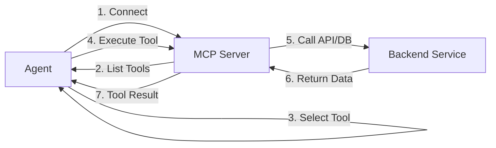

> MCP (Model Context Protocol) allows agents to access your external tools, APIs, and databases seamlessly. Learn more at [modelcontextprotocol.io](https://modelcontextprotocol.io/docs/getting-started/intro).

## Overview

The MCP primitive extends agent capabilities by connecting to external systems through the Model Context Protocol - an open standard for exposing tools, resources, and prompts to AI systems. MCP enables agents to interact with your APIs, databases, and services as if they were built-in capabilities.

MCP is essential for:

- **API Integration**: Connect agents to internal and external APIs
- **Database Access**: Query and manipulate data in your databases
- **Service Integration**: Integrate with CRMs, payment systems, analytics platforms
- **Tool Ecosystems**: Build reusable tool libraries across applications
- **Legacy System Access**: Bridge AI agents with existing infrastructure
- **Standardized Communication**: Use open protocol for maximum compatibility

<CardGroup cols={2}>
  <Card title="Open Standard" icon="code-branch">
    Built on open MCP specification - works with any MCP-compatible tools and services
  </Card>

  <Card title="Automatic Discovery" icon="magnifying-glass">
    Agents automatically discover available tools and use them as needed
  </Card>

  <Card title="Type-Safe" icon="shield-check">
    JSON Schema-based type definitions ensure reliable tool interactions
  </Card>

  <Card title="Authentication" icon="key">
    Support for bearer tokens, OAuth, and custom authentication methods
  </Card>
</CardGroup>

## How MCP Works

When you configure MCP servers for an agent:

1. **Connection**: Agent connects to specified MCP server endpoints
2. **Discovery**: Server exposes available tools with descriptions and schemas
3. **Selection**: Agent evaluates and selects appropriate tools for the task
4. **Execution**: Agent calls tools with proper parameters
5. **Response**: Server executes tool and returns structured results
6. **Integration**: Results are incorporated into agent's response

<Note>
**Open Protocol**: Agentbase implements the full Model Context Protocol specification. Any MCP-compatible server can integrate with Agentbase agents.
</Note>

## MCP Architecture

### Protocol Flow



### MCP Server Components

An MCP server provides:

- **Tool Definitions**: List of available tools with descriptions
- **Input Schemas**: JSON Schema for tool parameters
- **Output Schemas**: Expected return value structures
- **Execution Handlers**: Logic to execute tool calls
- **Authentication**: Security and access control
- **Error Handling**: Structured error responses

## Code Examples

### Basic MCP Integration

<CodeGroup>

```typescript TypeScript
import { Agentbase } from '@agentbase/sdk';

const agentbase = new Agentbase({
  apiKey: process.env.AGENTBASE_API_KEY
});

// Connect to MCP server
const result = await agentbase.runAgent({
  message: "Get customer data for user ID 12345",
  mcpServers: [
    {
      serverName: "customer-api",
      serverUrl: "https://api.yourcompany.com/mcp"
    }
  ]
});

// Agent automatically discovers and uses available tools
```

```python Python
from agentbase import Agentbase

agentbase = Agentbase(api_key=os.environ['AGENTBASE_API_KEY'])

# Connect to MCP server
result = agentbase.run_agent(
    message="Get customer data for user ID 12345",
    mcp_servers=[
        {
            "serverName": "customer-api",
            "serverUrl": "https://api.yourcompany.com/mcp"
        }
    ]
)

# Agent automatically discovers and uses available tools
```

```bash cURL
curl -X POST https://api.agentbase.sh \
  -H "Authorization: Bearer $AGENTBASE_API_KEY" \
  -H "Content-Type: application/json" \
  -d '{
    "message": "Get customer data for user ID 12345",
    "mcp_servers": [
      {
        "serverName": "customer-api",
        "serverUrl": "https://api.yourcompany.com/mcp"
      }
    ]
  }'
```

</CodeGroup>

### MCP with Authentication

<CodeGroup>

```typescript TypeScript
// Bearer token authentication
const result = await agentbase.runAgent({
  message: "Fetch sales data for Q4",
  mcpServers: [
    {
      serverName: "sales-api",
      serverUrl: "https://api.yourcompany.com/mcp",
      auth: {
        type: "bearer",
        token: process.env.API_TOKEN
      }
    }
  ]
});

// OAuth authentication
const oauthResult = await agentbase.runAgent({
  message: "Access user profile",
  mcpServers: [
    {
      serverName: "user-service",
      serverUrl: "https://users.yourcompany.com/mcp",
      auth: {
        type: "oauth",
        oauth: {
          accessToken: process.env.OAUTH_ACCESS_TOKEN,
          refreshToken: process.env.OAUTH_REFRESH_TOKEN
        }
      }
    }
  ]
});
```

```python Python
# Bearer token authentication
result = agentbase.run_agent(
    message="Fetch sales data for Q4",
    mcp_servers=[
        {
            "serverName": "sales-api",
            "serverUrl": "https://api.yourcompany.com/mcp",
            "auth": {
                "type": "bearer",
                "token": os.environ['API_TOKEN']
            }
        }
    ]
)

# OAuth authentication
oauth_result = agentbase.run_agent(
    message="Access user profile",
    mcp_servers=[
        {
            "serverName": "user-service",
            "serverUrl": "https://users.yourcompany.com/mcp",
            "auth": {
                "type": "oauth",
                "oauth": {
                    "accessToken": os.environ['OAUTH_ACCESS_TOKEN'],
                    "refreshToken": os.environ['OAUTH_REFRESH_TOKEN']
                }
            }
        }
    ]
)
```

</CodeGroup>

### Multiple MCP Servers

<CodeGroup>

```typescript TypeScript
// Connect to multiple MCP servers
const result = await agentbase.runAgent({
  message: "Create a customer order and charge their card",
  mcpServers: [
    {
      serverName: "crm-tools",
      serverUrl: "https://crm.yourcompany.com/mcp",
      auth: {
        type: "bearer",
        token: process.env.CRM_TOKEN
      }
    },
    {
      serverName: "payment-gateway",
      serverUrl: "https://payments.yourcompany.com/mcp",
      auth: {
        type: "bearer",
        token: process.env.PAYMENT_TOKEN
      }
    },
    {
      serverName: "inventory-system",
      serverUrl: "https://inventory.yourcompany.com/mcp"
    }
  ]
});

// Agent coordinates across multiple systems automatically
```

```python Python
# Connect to multiple MCP servers
result = agentbase.run_agent(
    message="Create a customer order and charge their card",
    mcp_servers=[
        {
            "serverName": "crm-tools",
            "serverUrl": "https://crm.yourcompany.com/mcp",
            "auth": {
                "type": "bearer",
                "token": os.environ['CRM_TOKEN']
            }
        },
        {
            "serverName": "payment-gateway",
            "serverUrl": "https://payments.yourcompany.com/mcp",
            "auth": {
                "type": "bearer",
                "token": os.environ['PAYMENT_TOKEN']
            }
        },
        {
            "serverName": "inventory-system",
            "serverUrl": "https://inventory.yourcompany.com/mcp"
        }
    ]
)

# Agent coordinates across multiple systems automatically
```

</CodeGroup>

## Building an MCP Server

### Complete MCP Server Implementation

<CodeGroup>

```typescript TypeScript (Express)
import express from 'express';
import { z } from 'zod';

const app = express();
app.use(express.json());

// Define available tools
const tools = [
  {
    name: 'get_customer',
    description: 'Retrieve customer information by customer ID',
    inputSchema: {
      type: 'object',
      properties: {
        customer_id: {
          type: 'string',
          description: 'The unique customer identifier'
        }
      },
      required: ['customer_id']
    }
  },
  {
    name: 'create_order',
    description: 'Create a new order for a customer',
    inputSchema: {
      type: 'object',
      properties: {
        customer_id: { type: 'string' },
        items: {
          type: 'array',
          items: {
            type: 'object',
            properties: {
              product_id: { type: 'string' },
              quantity: { type: 'number' }
            }
          }
        },
        total_amount: { type: 'number' }
      },
      required: ['customer_id', 'items', 'total_amount']
    }
  },
  {
    name: 'send_email',
    description: 'Send email to customer',
    inputSchema: {
      type: 'object',
      properties: {
        to: { type: 'string', format: 'email' },
        subject: { type: 'string' },
        body: { type: 'string' }
      },
      required: ['to', 'subject', 'body']
    }
  }
];

// Authentication middleware
app.use((req, res, next) => {
  const authHeader = req.headers.authorization;
  if (!authHeader || !authHeader.startsWith('Bearer ')) {
    return res.status(401).json({ error: 'Unauthorized' });
  }
  // Verify token
  const token = authHeader.substring(7);
  if (token !== process.env.VALID_API_TOKEN) {
    return res.status(401).json({ error: 'Invalid token' });
  }
  next();
});

// List available tools (MCP protocol)
app.post('/mcp/tools/list', (req, res) => {
  res.json({ tools });
});

// Execute tool (MCP protocol)
app.post('/mcp/tools/call', async (req, res) => {
  const { name, arguments: args } = req.body;

  try {
    switch (name) {
      case 'get_customer':
        const customer = await getCustomerFromDB(args.customer_id);
        res.json({
          content: [{
            type: 'text',
            text: JSON.stringify(customer)
          }]
        });
        break;

      case 'create_order':
        const order = await createOrderInDB(args);
        res.json({
          content: [{
            type: 'text',
            text: JSON.stringify(order)
          }]
        });
        break;

      case 'send_email':
        await sendEmailViaProvider(args);
        res.json({
          content: [{
            type: 'text',
            text: JSON.stringify({ success: true, message_id: '...' })
          }]
        });
        break;

      default:
        res.status(404).json({ error: 'Tool not found' });
    }
  } catch (error) {
    res.status(500).json({
      error: error.message,
      code: error.code || 'INTERNAL_ERROR'
    });
  }
});

// Helper functions
async function getCustomerFromDB(customerId: string) {
  // Query database
  const customer = await db.customers.findOne({ id: customerId });
  if (!customer) {
    throw new Error(`Customer ${customerId} not found`);
  }
  return customer;
}

async function createOrderInDB(orderData: any) {
  // Create order in database
  const order = await db.orders.create(orderData);
  return order;
}

async function sendEmailViaProvider(emailData: any) {
  // Send email via email service
  await emailService.send(emailData);
}

app.listen(3000, () => {
  console.log('MCP server running on port 3000');
});
```

```python Python (FastAPI)
from fastapi import FastAPI, HTTPException, Header, Depends
from pydantic import BaseModel, EmailStr
from typing import List, Dict, Any, Optional

app = FastAPI()

# Define available tools
tools = [
    {
        "name": "get_customer",
        "description": "Retrieve customer information by customer ID",
        "inputSchema": {
            "type": "object",
            "properties": {
                "customer_id": {
                    "type": "string",
                    "description": "The unique customer identifier"
                }
            },
            "required": ["customer_id"]
        }
    },
    {
        "name": "create_order",
        "description": "Create a new order for a customer",
        "inputSchema": {
            "type": "object",
            "properties": {
                "customer_id": {"type": "string"},
                "items": {
                    "type": "array",
                    "items": {
                        "type": "object",
                        "properties": {
                            "product_id": {"type": "string"},
                            "quantity": {"type": "number"}
                        }
                    }
                },
                "total_amount": {"type": "number"}
            },
            "required": ["customer_id", "items", "total_amount"]
        }
    },
    {
        "name": "send_email",
        "description": "Send email to customer",
        "inputSchema": {
            "type": "object",
            "properties": {
                "to": {"type": "string", "format": "email"},
                "subject": {"type": "string"},
                "body": {"type": "string"}
            },
            "required": ["to", "subject", "body"]
        }
    }
]

class ToolCallRequest(BaseModel):
    name: str
    arguments: Dict[str, Any]

# Authentication dependency
async def verify_token(authorization: str = Header(None)):
    if not authorization or not authorization.startswith("Bearer "):
        raise HTTPException(status_code=401, detail="Unauthorized")
    token = authorization[7:]
    if token != os.environ.get('VALID_API_TOKEN'):
        raise HTTPException(status_code=401, detail="Invalid token")
    return token

# List available tools (MCP protocol)
@app.post("/mcp/tools/list")
async def list_tools(token: str = Depends(verify_token)):
    return {"tools": tools}

# Execute tool (MCP protocol)
@app.post("/mcp/tools/call")
async def call_tool(
    request: ToolCallRequest,
    token: str = Depends(verify_token)
):
    try:
        if request.name == "get_customer":
            customer = await get_customer_from_db(
                request.arguments["customer_id"]
            )
            return {
                "content": [{
                    "type": "text",
                    "text": str(customer)
                }]
            }

        elif request.name == "create_order":
            order = await create_order_in_db(request.arguments)
            return {
                "content": [{
                    "type": "text",
                    "text": str(order)
                }]
            }

        elif request.name == "send_email":
            await send_email_via_provider(request.arguments)
            return {
                "content": [{
                    "type": "text",
                    "text": '{"success": true, "message_id": "..."}'
                }]
            }

        else:
            raise HTTPException(status_code=404, detail="Tool not found")

    except Exception as e:
        raise HTTPException(
            status_code=500,
            detail={
                "error": str(e),
                "code": getattr(e, 'code', 'INTERNAL_ERROR')
            }
        )

# Helper functions
async def get_customer_from_db(customer_id: str):
    customer = await db.customers.find_one({"id": customer_id})
    if not customer:
        raise Exception(f"Customer {customer_id} not found")
    return customer

async def create_order_in_db(order_data: dict):
    order = await db.orders.insert_one(order_data)
    return order

async def send_email_via_provider(email_data: dict):
    await email_service.send(email_data)
```

</CodeGroup>

### Tool Schema Best Practices

<AccordionGroup>
  <Accordion title="Descriptive Tool Names">
    ```json
    // Good: Clear, specific names
    {
      "name": "get_customer_by_id",
      "name": "create_sales_order",
      "name": "send_welcome_email"
    }

    // Avoid: Vague names
    {
      "name": "get_data",
      "name": "create_thing",
      "name": "send"
    }
    ```
  </Accordion>

  <Accordion title="Detailed Descriptions">
    ```json
    {
      "name": "search_products",
      "description": "Search the product catalog with filters. Returns products matching all specified criteria including name, category, price range, and availability status. Results are sorted by relevance.",
      "inputSchema": {
        "type": "object",
        "properties": {
          "query": {
            "type": "string",
            "description": "Search terms to match against product names and descriptions. Supports partial matching."
          },
          "category": {
            "type": "string",
            "description": "Product category to filter by (e.g., 'electronics', 'clothing', 'books')"
          },
          "max_price": {
            "type": "number",
            "description": "Maximum price in USD. Products with higher prices will be excluded."
          }
        }
      }
    }
    ```
  </Accordion>

  <Accordion title="Type Constraints">
    ```json
    {
      "name": "create_user",
      "inputSchema": {
        "type": "object",
        "properties": {
          "email": {
            "type": "string",
            "format": "email",
            "description": "Valid email address"
          },
          "age": {
            "type": "integer",
            "minimum": 18,
            "maximum": 120
          },
          "role": {
            "type": "string",
            "enum": ["admin", "user", "guest"]
          },
          "tags": {
            "type": "array",
            "items": {"type": "string"},
            "maxItems": 10
          }
        },
        "required": ["email", "role"]
      }
    }
    ```
  </Accordion>
</AccordionGroup>

## Common Use Cases

### Database Integration

<CodeGroup>

```typescript TypeScript
// Connect agent to database via MCP
const result = await agentbase.runAgent({
  message: "Show me all active users from California",
  mcpServers: [
    {
      serverName: "company-db",
      serverUrl: "https://db-mcp.yourcompany.com"
    }
  ]
});

// MCP server provides tools like:
// - query_users(filters)
// - get_user_by_id(id)
// - update_user(id, data)
// - get_user_orders(user_id)
```

```python Python
# Connect agent to database via MCP
result = agentbase.run_agent(
    message="Show me all active users from California",
    mcp_servers=[
        {
            "serverName": "company-db",
            "serverUrl": "https://db-mcp.yourcompany.com"
        }
    ]
)

# MCP server provides tools like:
# - query_users(filters)
# - get_user_by_id(id)
# - update_user(id, data)
# - get_user_orders(user_id)
```

</CodeGroup>

### API Integration

```typescript
// CRM integration example
const result = await agentbase.runAgent({
  message: "Find all high-value customers who haven't been contacted in 30 days",
  mcpServers: [
    {
      serverName: "salesforce-mcp",
      serverUrl: "https://mcp.yourcompany.com/salesforce",
      auth: {
        type: "oauth",
        oauth: {
          accessToken: salesforceToken
        }
      }
    }
  ]
});

// Available tools:
// - search_contacts(criteria)
// - get_contact_interactions(contact_id)
// - create_task(contact_id, task_data)
// - get_deal_value(deal_id)
```

### Payment Processing

```typescript
// Payment gateway integration
const result = await agentbase.runAgent({
  message: "Process payment for order 12345",
  mcpServers: [
    {
      serverName: "stripe-mcp",
      serverUrl: "https://mcp.yourcompany.com/stripe",
      auth: {
        type: "bearer",
        token: process.env.STRIPE_SECRET_KEY
      }
    }
  ]
});

// Tools available:
// - create_payment_intent(amount, currency)
// - capture_payment(payment_intent_id)
// - refund_payment(payment_intent_id, amount)
// - get_customer_payment_methods(customer_id)
```

### E-Commerce Operations

```typescript
// Shopify integration
const result = await agentbase.runAgent({
  message: "Get pending orders and update inventory",
  mcpServers: [
    {
      serverName: "shopify-integration",
      serverUrl: "https://mcp.yourcompany.com/shopify"
    }
  ]
});

// Available tools:
// - get_orders(status)
// - update_order_status(order_id, status)
// - get_inventory_levels(product_id)
// - update_inventory(product_id, quantity)
// - create_fulfillment(order_id, tracking)
```

### Communication Services

```typescript
// Email and SMS integration
const result = await agentbase.runAgent({
  message: "Send order confirmation to customer",
  mcpServers: [
    {
      serverName: "communication-tools",
      serverUrl: "https://mcp.yourcompany.com/comms"
    }
  ]
});

// Tools:
// - send_email(to, subject, body, template)
// - send_sms(to, message)
// - create_notification(user_id, type, message)
```

### Cloud Infrastructure

```typescript
// AWS/GCP/Azure integration
const result = await agentbase.runAgent({
  message: "Check production server health and scale if needed",
  mcpServers: [
    {
      serverName: "aws-mcp",
      serverUrl: "https://mcp.yourcompany.com/aws",
      auth: {
        type: "bearer",
        token: awsCredentials
      }
    }
  ]
});

// Tools:
// - get_ec2_instances(filters)
// - describe_auto_scaling_groups()
// - update_auto_scaling(group, min, max, desired)
// - get_cloudwatch_metrics(metric_name, period)
```

## Best Practices

### Security

<Warning>
**Never Expose Credentials**: Never include API keys or tokens directly in code. Always use environment variables or secure credential management.
</Warning>

<AccordionGroup>
  <Accordion title="Use Scoped Tokens">
    ```typescript
    // Good: User-specific, scoped tokens
    const result = await agentbase.runAgent({
      message: "Get my orders",
      mcpServers: [
        {
          serverName: "api",
          serverUrl: "https://api.company.com/mcp",
          auth: {
            type: "bearer",
            token: getUserScopedToken(userId) // Scoped to user
          }
        }
      ]
    });

    // Avoid: Shared admin tokens
    auth: {
      type: "bearer",
      token: ADMIN_TOKEN // Too broad permissions
    }
    ```
  </Accordion>

  <Accordion title="Validate All Inputs">
    ```typescript
    // Server-side input validation
    app.post('/mcp/tools/call', async (req, res) => {
      const { name, arguments: args } = req.body;

      if (name === 'delete_user') {
        // Validate user_id
        if (!args.user_id || typeof args.user_id !== 'string') {
          return res.status(400).json({
            error: 'Invalid user_id parameter'
          });
        }

        // Check authorization
        if (!canDeleteUser(req.user, args.user_id)) {
          return res.status(403).json({
            error: 'Insufficient permissions'
          });
        }

        // Proceed with deletion
        await deleteUser(args.user_id);
      }
    });
    ```
  </Accordion>

  <Accordion title="Implement Rate Limiting">
    ```typescript
    import rateLimit from 'express-rate-limit';

    const limiter = rateLimit({
      windowMs: 15 * 60 * 1000, // 15 minutes
      max: 100, // Max 100 requests per window
      message: 'Too many requests'
    });

    app.use('/mcp', limiter);
    ```
  </Accordion>

  <Accordion title="Audit Logging">
    ```typescript
    // Log all tool executions
    app.post('/mcp/tools/call', async (req, res) => {
      const { name, arguments: args } = req.body;

      // Log the call
      await auditLog.create({
        tool: name,
        arguments: args,
        user: req.user.id,
        timestamp: new Date(),
        ip: req.ip
      });

      // Execute tool...
    });
    ```
  </Accordion>
</AccordionGroup>

### Performance

<Tip>
**Cache Responses**: Cache frequently requested data to reduce load on backend systems and improve response times.
</Tip>

```typescript
import NodeCache from 'node-cache';
const cache = new NodeCache({ stdTTL: 300 }); // 5 minute TTL

app.post('/mcp/tools/call', async (req, res) => {
  const { name, arguments: args } = req.body;

  if (name === 'get_product_catalog') {
    const cacheKey = `catalog_${args.category}`;
    const cached = cache.get(cacheKey);

    if (cached) {
      return res.json({
        content: [{ type: 'text', text: cached }]
      });
    }

    const catalog = await getProductCatalog(args.category);
    cache.set(cacheKey, JSON.stringify(catalog));

    res.json({
      content: [{ type: 'text', text: JSON.stringify(catalog) }]
    });
  }
});
```

### Error Handling

```typescript
// Return structured, helpful errors
app.post('/mcp/tools/call', async (req, res) => {
  try {
    // Tool execution...
  } catch (error) {
    // Structured error response
    res.status(500).json({
      error: {
        code: error.code || 'INTERNAL_ERROR',
        message: error.message,
        details: {
          tool: req.body.name,
          suggestion: getErrorSuggestion(error)
        }
      }
    });
  }
});

function getErrorSuggestion(error) {
  if (error.code === 'CUSTOMER_NOT_FOUND') {
    return 'Verify the customer ID and try again';
  }
  if (error.code === 'INSUFFICIENT_INVENTORY') {
    return 'Check inventory levels before creating order';
  }
  return 'Please try again or contact support';
}
```

## Integration with Other Primitives

### With Prompts

Guide tool usage with system prompts:

```typescript
const result = await agentbase.runAgent({
  message: "Help customer with order status",
  system: `You are a customer service agent.

  When helping with orders:
  1. Use get_order_status tool to check current status
  2. Use get_tracking_info if order is shipped
  3. Always provide tracking numbers when available
  4. Escalate to human if issues found`,
  mcpServers: [
    {
      serverName: "order-tools",
      serverUrl: "https://api.yourcompany.com/mcp"
    }
  ]
});
```

Learn more: [Prompts Primitive](/primitives/essentials/prompts)

### With Rules

Enforce constraints on tool usage:

```typescript
const result = await agentbase.runAgent({
  message: "Update customer record",
  mcpServers: [
    {
      serverName: "customer-api",
      serverUrl: "https://api.yourcompany.com/mcp"
    }
  ],
  rules: [
    "Always verify customer identity before accessing account data",
    "Never update payment information without explicit customer confirmation",
    "Log all customer data access for audit purposes"
  ]
});
```

Learn more: [Rules](/build/rules)

### With Workflows

Use MCP tools within workflow steps:

```typescript
const workflow = {
  name: "order_processing",
  steps: [
    {
      id: "check_inventory",
      type: "agent_task",
      config: {
        message: "Check inventory for order items",
        mcpServers: [
          { serverName: "inventory" }
        ]
      }
    },
    {
      id: "process_payment",
      type: "agent_task",
      config: {
        message: "Process customer payment",
        mcpServers: [
          { serverName: "payment-gateway" }
        ]
      }
    }
  ]
};

await agentbase.executeWorkflow({ workflow });
```

Learn more: [Workflow Primitive](/primitives/extensions/workflow)

## Performance Considerations

### Tool Discovery Overhead

- **First Request**: ~100-500ms to discover tools
- **Subsequent Requests**: Tools cached within session
- **Optimization**: Group related tools in single MCP server

### Network Latency

<Tip>
**Co-location**: Deploy MCP servers in same region as Agentbase for lowest latency.
</Tip>

- **Same Region**: ~10-50ms
- **Cross-Region**: ~100-300ms
- **Different Continent**: ~200-500ms

### Cost Optimization

```typescript
// Batch operations when possible
const result = await agentbase.runAgent({
  message: "Process these 100 orders",
  mcpServers: [
    {
      serverName: "order-processor",
      serverUrl: "https://api.company.com/mcp"
    }
  ]
});

// MCP server provides batch tool:
// - process_orders_batch(order_ids) // More efficient than 100 individual calls
```

## Troubleshooting

<AccordionGroup>
  <Accordion title="Agent Not Using MCP Tools">
    **Problem**: Agent doesn't call your MCP tools

    **Solutions**:
    - Improve tool descriptions
    - Add guidance in system prompt
    - Verify MCP server is accessible
    - Check authentication
    - Test tool discovery endpoint manually

    ```bash
    # Test tool discovery
    curl -X POST https://your-mcp-server.com/mcp/tools/list \
      -H "Authorization: Bearer YOUR_TOKEN"
    ```
  </Accordion>

  <Accordion title="Authentication Failures">
    **Problem**: 401/403 errors from MCP server

    **Solutions**:
    - Verify token is valid and not expired
    - Check token has required permissions
    - Ensure auth type matches server expectations
    - Test auth with direct API call

    ```typescript
    // Debug authentication
    try {
      const result = await agentbase.runAgent({
        message: "Test",
        mcpServers: [
          {
            serverName: "test",
            serverUrl: "...",
            auth: {
              type: "bearer",
              token: testToken
            }
          }
        ]
      });
    } catch (error) {
      console.error('Auth error:', error);
    }
    ```
  </Accordion>

  <Accordion title="Slow Tool Execution">
    **Problem**: MCP tools taking too long

    **Solutions**:
    - Add caching for frequent requests
    - Optimize database queries
    - Use connection pooling
    - Implement pagination
    - Monitor server performance

    ```typescript
    // Add timeout
    app.post('/mcp/tools/call', async (req, res) => {
      const timeout = setTimeout(() => {
        res.status(408).json({
          error: 'Tool execution timeout'
        });
      }, 30000); // 30 second timeout

      try {
        const result = await executeTool(req.body);
        clearTimeout(timeout);
        res.json(result);
      } catch (error) {
        clearTimeout(timeout);
        throw error;
      }
    });
    ```
  </Accordion>

  <Accordion title="Tool Schema Validation Errors">
    **Problem**: Tool calls failing validation

    **Solutions**:
    - Review JSON Schema definitions
    - Add clear examples in descriptions
    - Test with sample inputs
    - Provide helpful error messages

    ```typescript
    // Validate with better errors
    if (!validateToolInput(args, tool.inputSchema)) {
      return res.status(400).json({
        error: 'Invalid tool parameters',
        expected: tool.inputSchema,
        received: args,
        example: tool.example // Provide example
      });
    }
    ```
  </Accordion>
</AccordionGroup>

## Related Primitives

<CardGroup cols={2}>
  <Card title="Custom Tools" icon="toolbox" href="/primitives/essentials/custom-tools">
    Learn more about tool integration patterns
  </Card>

  <Card title="Prompts" icon="message-bot" href="/primitives/essentials/prompts">
    Guide agents on tool usage
  </Card>

  <Card title="Workflows" icon="diagram-project" href="/primitives/extensions/workflow">
    Use tools within structured workflows
  </Card>

  <Card title="Orchestration" icon="network-wired" href="/primitives/extensions/orchestration">
    Coordinate tools across multiple agents
  </Card>
</CardGroup>

## Additional Resources

<CardGroup cols={3}>
  <Card title="MCP Specification" icon="book" href="https://modelcontextprotocol.io">
    Official Model Context Protocol docs
  </Card>

  <Card title="API Reference" icon="code" href="/api/run-agent">
    Complete MCP parameters
  </Card>

  <Card title="MCP Examples" icon="lightbulb" href="/examples/mcp">
    Example MCP server implementations
  </Card>
</CardGroup>

<Tip>
**Remember**: MCP is an open standard. Build your MCP server once and use it with any MCP-compatible AI system, not just Agentbase.
</Tip>
