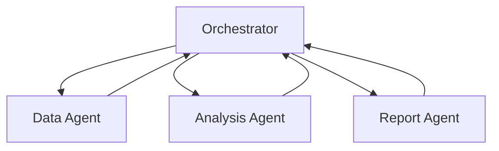
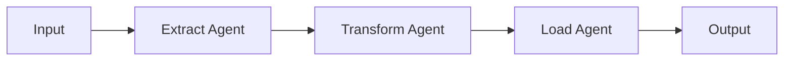
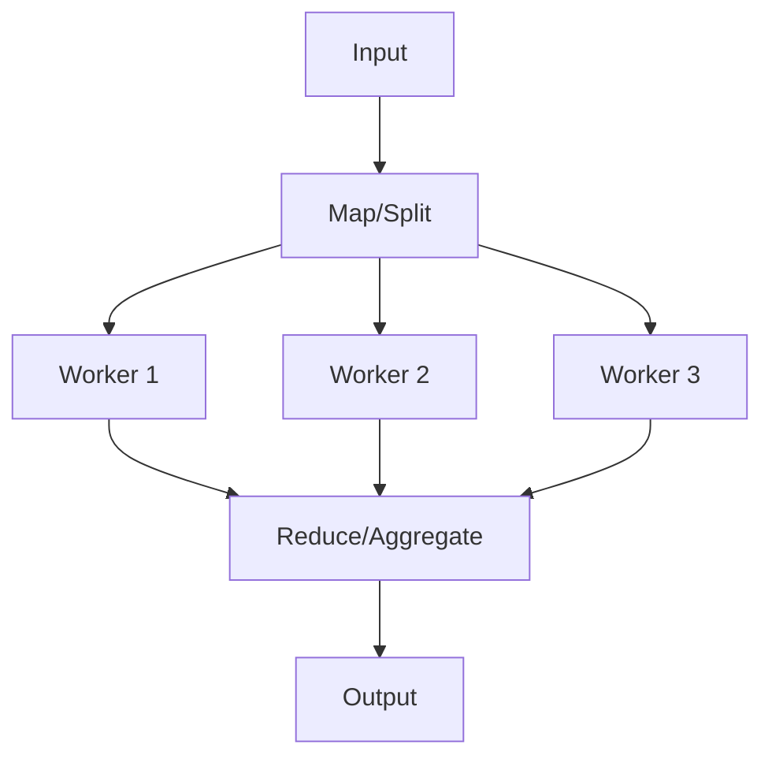

> Orchestration enables the coordination of multiple agents, workflows, and external systems to solve complex problems that require specialized capabilities and parallel execution.

## Overview

The Orchestration primitive provides the framework for coordinating complex operations across multiple agents, workflows, and systems. Unlike single-agent execution or linear workflows, orchestration manages parallel operations, dynamic task distribution, resource allocation, and inter-agent communication.

Orchestration is essential for:

- **Complex Problem Solving**: Break down complex tasks across specialized agents
- **Parallel Execution**: Run multiple operations simultaneously for efficiency
- **Resource Management**: Allocate tasks based on agent capabilities and availability
- **Dynamic Coordination**: Adapt execution based on intermediate results
- **System Integration**: Coordinate across multiple external systems and services
- **Scalability**: Handle high-volume operations with automatic load distribution

<CardGroup cols={2}>
  <Card title="Multi-Agent Coordination" icon="users">
    Manage multiple specialized agents working together on complex tasks
  </Card>

  <Card title="Dynamic Task Routing" icon="route">
    Intelligently route tasks to appropriate agents based on capabilities
  </Card>

  <Card title="Parallel Execution" icon="arrows-split-up-and-left">
    Execute multiple operations concurrently for optimal performance
  </Card>

  <Card title="State Synchronization" icon="sync">
    Maintain consistent state across distributed agent executions
  </Card>
</CardGroup>

## How Orchestration Works

When you use orchestration:

1. **Task Analysis**: Orchestrator analyzes the problem and identifies sub-tasks
2. **Agent Selection**: Routes tasks to appropriate specialized agents
3. **Parallel Execution**: Executes independent tasks concurrently
4. **Result Aggregation**: Collects and synthesizes results from all agents
5. **Dependency Management**: Ensures tasks execute in proper order when dependent
6. **Error Handling**: Manages failures and retries across distributed execution

<Note>
**Intelligent Routing**: The orchestrator automatically selects the best agent for each task based on capabilities, availability, and past performance.
</Note>

## Orchestration Patterns

### Hub-and-Spoke

Central orchestrator coordinates multiple specialized agents:



### Pipeline

Sequential processing through specialized agents:



### Map-Reduce

Parallel processing with aggregation:



## Code Examples

### Basic Orchestration

<CodeGroup>

```typescript TypeScript
import { Agentbase } from '@agentbase/sdk';

const agentbase = new Agentbase({
  apiKey: process.env.AGENTBASE_API_KEY
});

// Define specialized agents
const agents = [
  {
    name: "Research Agent",
    description: "Researches topics and gathers information",
    system: "You are a research specialist. Gather comprehensive information on assigned topics."
  },
  {
    name: "Analysis Agent",
    description: "Analyzes data and identifies patterns",
    system: "You are a data analyst. Analyze information and identify key insights."
  },
  {
    name: "Writing Agent",
    description: "Creates written content and reports",
    system: "You are a professional writer. Create clear, compelling content."
  }
];

// Orchestrate complex task
const result = await agentbase.orchestrate({
  task: "Create a comprehensive market analysis report for electric vehicles",
  agents: agents,
  strategy: "parallel" // Execute tasks in parallel when possible
});

console.log('Orchestration result:', result.output);
```

```python Python
from agentbase import Agentbase

agentbase = Agentbase(api_key=os.environ['AGENTBASE_API_KEY'])

# Define specialized agents
agents = [
    {
        "name": "Research Agent",
        "description": "Researches topics and gathers information",
        "system": "You are a research specialist. Gather comprehensive information on assigned topics."
    },
    {
        "name": "Analysis Agent",
        "description": "Analyzes data and identifies patterns",
        "system": "You are a data analyst. Analyze information and identify key insights."
    },
    {
        "name": "Writing Agent",
        "description": "Creates written content and reports",
        "system": "You are a professional writer. Create clear, compelling content."
    }
]

# Orchestrate complex task
result = agentbase.orchestrate(
    task="Create a comprehensive market analysis report for electric vehicles",
    agents=agents,
    strategy="parallel" # Execute tasks in parallel when possible
)

print(f"Orchestration result: {result.output}")
```

</CodeGroup>

### Explicit Task Distribution

<CodeGroup>

```typescript TypeScript
// Define specific tasks for each agent
const orchestration = await agentbase.orchestrate({
  tasks: [
    {
      id: "research",
      agent: "Research Agent",
      task: "Research current electric vehicle market trends and competitors",
      dependencies: []
    },
    {
      id: "analyze_data",
      agent: "Analysis Agent",
      task: "Analyze the research data and identify key market patterns",
      dependencies: ["research"] // Waits for research to complete
    },
    {
      id: "create_visualizations",
      agent: "Analysis Agent",
      task: "Create charts and graphs of market data",
      dependencies: ["analyze_data"]
    },
    {
      id: "write_report",
      agent: "Writing Agent",
      task: "Write comprehensive market analysis report",
      dependencies: ["analyze_data", "create_visualizations"]
    }
  ],
  agents: agents
});

console.log('Final report:', orchestration.results['write_report']);
```

```python Python
# Define specific tasks for each agent
orchestration = agentbase.orchestrate(
    tasks=[
        {
            "id": "research",
            "agent": "Research Agent",
            "task": "Research current electric vehicle market trends and competitors",
            "dependencies": []
        },
        {
            "id": "analyze_data",
            "agent": "Analysis Agent",
            "task": "Analyze the research data and identify key market patterns",
            "dependencies": ["research"] # Waits for research to complete
        },
        {
            "id": "create_visualizations",
            "agent": "Analysis Agent",
            "task": "Create charts and graphs of market data",
            "dependencies": ["analyze_data"]
        },
        {
            "id": "write_report",
            "agent": "Writing Agent",
            "task": "Write comprehensive market analysis report",
            "dependencies": ["analyze_data", "create_visualizations"]
        }
    ],
    agents=agents
)

print(f"Final report: {orchestration.results['write_report']}")
```

</CodeGroup>

### Map-Reduce Pattern

<CodeGroup>

```typescript TypeScript
// Process large dataset in parallel
const mapReduce = await agentbase.orchestrate({
  pattern: "map-reduce",
  map: {
    agent: "Processing Agent",
    task: "Analyze customer feedback",
    input: customerFeedbackList, // Array of 1000 feedback items
    batchSize: 50 // Process 50 items per agent instance
  },
  reduce: {
    agent: "Aggregation Agent",
    task: "Synthesize insights from all processed feedback"
  },
  agents: [
    {
      name: "Processing Agent",
      system: "Analyze customer feedback and extract sentiment, topics, and key issues."
    },
    {
      name: "Aggregation Agent",
      system: "Combine analysis results and identify overall patterns and priorities."
    }
  ]
});

console.log('Aggregated insights:', mapReduce.result);
```

```python Python
# Process large dataset in parallel
map_reduce = agentbase.orchestrate(
    pattern="map-reduce",
    map={
        "agent": "Processing Agent",
        "task": "Analyze customer feedback",
        "input": customer_feedback_list, # Array of 1000 feedback items
        "batch_size": 50 # Process 50 items per agent instance
    },
    reduce={
        "agent": "Aggregation Agent",
        "task": "Synthesize insights from all processed feedback"
    },
    agents=[
        {
            "name": "Processing Agent",
            "system": "Analyze customer feedback and extract sentiment, topics, and key issues."
        },
        {
            "name": "Aggregation Agent",
            "system": "Combine analysis results and identify overall patterns and priorities."
        }
    ]
)

print(f"Aggregated insights: {map_reduce.result}")
```

</CodeGroup>

### Dynamic Agent Routing

<CodeGroup>

```typescript TypeScript
// Let orchestrator decide which agents to use
const dynamic = await agentbase.orchestrate({
  task: "I need help analyzing Q4 financial data and creating a presentation",
  agents: [
    {
      name: "Financial Analyst",
      description: "Expert in financial analysis and reporting",
      capabilities: ["financial_analysis", "data_processing"]
    },
    {
      name: "Data Scientist",
      description: "Expert in statistical analysis and ML",
      capabilities: ["statistics", "machine_learning", "data_visualization"]
    },
    {
      name: "Presentation Designer",
      description: "Expert in creating presentations and slides",
      capabilities: ["presentation_design", "visual_communication"]
    },
    {
      name: "Business Strategist",
      description: "Expert in business strategy and insights",
      capabilities: ["strategy", "business_insights"]
    }
  ],
  routing: "automatic" // Orchestrator selects appropriate agents
});

// Orchestrator automatically routes:
// - Financial analysis → Financial Analyst
// - Data visualization → Data Scientist
// - Presentation creation → Presentation Designer
// - Strategic insights → Business Strategist
```

```python Python
# Let orchestrator decide which agents to use
dynamic = agentbase.orchestrate(
    task="I need help analyzing Q4 financial data and creating a presentation",
    agents=[
        {
            "name": "Financial Analyst",
            "description": "Expert in financial analysis and reporting",
            "capabilities": ["financial_analysis", "data_processing"]
        },
        {
            "name": "Data Scientist",
            "description": "Expert in statistical analysis and ML",
            "capabilities": ["statistics", "machine_learning", "data_visualization"]
        },
        {
            "name": "Presentation Designer",
            "description": "Expert in creating presentations and slides",
            "capabilities": ["presentation_design", "visual_communication"]
        },
        {
            "name": "Business Strategist",
            "description": "Expert in business strategy and insights",
            "capabilities": ["strategy", "business_insights"]
        }
    ],
    routing="automatic" # Orchestrator selects appropriate agents
)
```

</CodeGroup>

### Monitoring Orchestration

<CodeGroup>

```typescript TypeScript
// Monitor orchestration progress
const orchestration = await agentbase.orchestrate({
  task: "Complex multi-step analysis",
  agents: agents,
  onProgress: (update) => {
    console.log(`Task ${update.taskId}: ${update.status}`);
    console.log(`Progress: ${update.completed}/${update.total}`);
    console.log(`Current agent: ${update.currentAgent}`);
  }
});

// Get detailed execution trace
const trace = await agentbase.getOrchestrationTrace({
  orchestrationId: orchestration.id
});

trace.steps.forEach(step => {
  console.log(`${step.agent}: ${step.task} - ${step.duration}ms`);
});
```

```python Python
# Monitor orchestration progress
def on_progress(update):
    print(f"Task {update.task_id}: {update.status}")
    print(f"Progress: {update.completed}/{update.total}")
    print(f"Current agent: {update.current_agent}")

orchestration = agentbase.orchestrate(
    task="Complex multi-step analysis",
    agents=agents,
    on_progress=on_progress
)

# Get detailed execution trace
trace = agentbase.get_orchestration_trace(
    orchestration_id=orchestration.id
)

for step in trace.steps:
    print(f"{step.agent}: {step.task} - {step.duration}ms")
```

</CodeGroup>

## Use Cases

### 1. Comprehensive Research Reports

Orchestrate research, analysis, and writing:

```typescript
const researchOrchestration = {
  task: "Create comprehensive analysis of renewable energy trends",
  agents: [
    {
      name: "Web Researcher",
      description: "Searches and gathers information from web sources",
      tools: ["web_search", "web_scrape"]
    },
    {
      name: "Academic Researcher",
      description: "Searches academic papers and journals",
      tools: ["academic_search"]
    },
    {
      name: "Data Analyst",
      description: "Analyzes numerical data and trends",
      tools: ["data_analysis", "visualization"]
    },
    {
      name: "Report Writer",
      description: "Synthesizes information into comprehensive reports",
      tools: ["document_creation"]
    }
  ],
  tasks: [
    {
      id: "web_research",
      agent: "Web Researcher",
      task: "Research current renewable energy market trends"
    },
    {
      id: "academic_research",
      agent: "Academic Researcher",
      task: "Find recent academic papers on renewable energy technology"
    },
    {
      id: "data_analysis",
      agent: "Data Analyst",
      task: "Analyze renewable energy adoption statistics",
      dependencies: ["web_research"]
    },
    {
      id: "create_report",
      agent: "Report Writer",
      task: "Create comprehensive report synthesizing all research",
      dependencies: ["web_research", "academic_research", "data_analysis"]
    }
  ]
};

const report = await agentbase.orchestrate(researchOrchestration);
```

### 2. E-Commerce Order Processing

Coordinate order fulfillment across multiple systems:

```typescript
const orderOrchestration = await agentbase.orchestrate({
  task: `Process order ${orderId}`,
  agents: [
    {
      name: "Inventory Agent",
      description: "Manages inventory checking and allocation",
      mcpServers: [{ serverName: "inventory-system" }]
    },
    {
      name: "Payment Agent",
      description: "Handles payment processing",
      mcpServers: [{ serverName: "payment-gateway" }]
    },
    {
      name: "Shipping Agent",
      description: "Manages shipping and logistics",
      mcpServers: [{ serverName: "shipping-service" }]
    },
    {
      name: "Notification Agent",
      description: "Sends customer notifications",
      mcpServers: [{ serverName: "email-service" }]
    }
  ],
  tasks: [
    {
      id: "check_inventory",
      agent: "Inventory Agent",
      task: "Check inventory availability for all items"
    },
    {
      id: "reserve_items",
      agent: "Inventory Agent",
      task: "Reserve inventory for order",
      dependencies: ["check_inventory"]
    },
    {
      id: "process_payment",
      agent: "Payment Agent",
      task: "Process customer payment",
      dependencies: ["reserve_items"]
    },
    {
      id: "create_shipment",
      agent: "Shipping Agent",
      task: "Create shipping label and schedule pickup",
      dependencies: ["process_payment"]
    },
    {
      id: "send_confirmation",
      agent: "Notification Agent",
      task: "Send order confirmation to customer",
      dependencies: ["process_payment"]
    },
    {
      id: "send_tracking",
      agent: "Notification Agent",
      task: "Send tracking information to customer",
      dependencies: ["create_shipment"]
    }
  ]
});
```

### 3. Content Production Pipeline

Orchestrate content creation workflow:

```typescript
const contentPipeline = await agentbase.orchestrate({
  pattern: "pipeline",
  stages: [
    {
      name: "Ideation",
      agent: "Content Strategist",
      task: "Generate content ideas based on topic: {{topic}}"
    },
    {
      name: "Research",
      agent: "Researcher",
      task: "Research facts and data for content ideas"
    },
    {
      name: "Writing",
      agent: "Copywriter",
      task: "Write engaging content based on research"
    },
    {
      name: "Editing",
      agent: "Editor",
      task: "Edit content for clarity, grammar, and style"
    },
    {
      name: "SEO Optimization",
      agent: "SEO Specialist",
      task: "Optimize content for search engines"
    },
    {
      name: "Visual Design",
      agent: "Designer",
      task: "Create visual assets for content"
    },
    {
      name: "Publishing",
      agent: "Publisher",
      task: "Format and publish content to CMS"
    }
  ],
  input: { topic: "AI in Healthcare" }
});
```

### 4. Customer Support Triage

Route and handle support tickets:

```typescript
const supportOrchestration = await agentbase.orchestrate({
  task: "Handle incoming support tickets",
  agents: [
    {
      name: "Triage Agent",
      description: "Categorizes and prioritizes support tickets"
    },
    {
      name: "Technical Support",
      description: "Handles technical issues and bugs",
      capabilities: ["technical_troubleshooting"]
    },
    {
      name: "Billing Support",
      description: "Handles billing and payment questions",
      capabilities: ["billing", "payments"]
    },
    {
      name: "Account Support",
      description: "Handles account access and settings",
      capabilities: ["account_management"]
    },
    {
      name: "Escalation Agent",
      description: "Escalates complex issues to human support"
    }
  ],
  routing: "automatic",
  pattern: "hub-spoke" // Triage agent routes to specialists
});

// For each ticket, triage agent determines:
// - Urgency level
// - Category (technical, billing, account)
// - Appropriate specialist agent
// - Whether escalation is needed
```

### 5. Data Processing Pipeline

Process large datasets with parallel agents:

```typescript
const dataProcessing = await agentbase.orchestrate({
  pattern: "map-reduce",
  map: {
    agent: "Data Processor",
    task: "Clean and validate data records",
    input: rawDataRecords,
    batchSize: 1000,
    parallel: 10 // Run 10 processors in parallel
  },
  reduce: {
    agent: "Data Aggregator",
    task: "Merge processed data and generate summary statistics"
  },
  agents: [
    {
      name: "Data Processor",
      system: `Clean and validate data records:
        - Remove duplicates
        - Validate formats
        - Normalize values
        - Flag anomalies`
    },
    {
      name: "Data Aggregator",
      system: `Merge results and create:
        - Summary statistics
        - Data quality report
        - Anomaly report`
    }
  ]
});

console.log('Processed records:', dataProcessing.totalRecords);
console.log('Quality score:', dataProcessing.qualityScore);
```

### 6. Software Development Workflow

Coordinate development tasks:

```typescript
const devOrchestration = await agentbase.orchestrate({
  task: "Implement new feature: user authentication",
  agents: [
    {
      name: "Architect",
      description: "Designs system architecture and technical approach"
    },
    {
      name: "Backend Developer",
      description: "Implements backend API and services"
    },
    {
      name: "Frontend Developer",
      description: "Implements UI components"
    },
    {
      name: "QA Engineer",
      description: "Creates tests and validates functionality"
    },
    {
      name: "DevOps Engineer",
      description: "Handles deployment and infrastructure"
    }
  ],
  tasks: [
    {
      id: "design",
      agent: "Architect",
      task: "Design authentication system architecture"
    },
    {
      id: "backend_api",
      agent: "Backend Developer",
      task: "Implement authentication API endpoints",
      dependencies: ["design"]
    },
    {
      id: "frontend_ui",
      agent: "Frontend Developer",
      task: "Implement login and registration UI",
      dependencies: ["design"]
    },
    {
      id: "backend_tests",
      agent: "QA Engineer",
      task: "Create backend API tests",
      dependencies: ["backend_api"]
    },
    {
      id: "frontend_tests",
      agent: "QA Engineer",
      task: "Create frontend UI tests",
      dependencies: ["frontend_ui"]
    },
    {
      id: "deployment",
      agent: "DevOps Engineer",
      task: "Deploy authentication service to staging",
      dependencies: ["backend_tests", "frontend_tests"]
    }
  ]
});
```

## Best Practices

### Agent Design

<AccordionGroup>
  <Accordion title="Single Responsibility">
    ```typescript
    // Good: Focused, specialized agents
    agents: [
      {
        name: "Data Extractor",
        description: "Extracts data from sources",
        capabilities: ["data_extraction"]
      },
      {
        name: "Data Transformer",
        description: "Transforms and cleans data",
        capabilities: ["data_transformation"]
      },
      {
        name: "Data Loader",
        description: "Loads data to destinations",
        capabilities: ["data_loading"]
      }
    ]

    // Avoid: Jack-of-all-trades agents
    agents: [
      {
        name: "Data Agent",
        description: "Does everything with data"
      }
    ]
    ```
  </Accordion>

  <Accordion title="Clear Capability Definitions">
    ```typescript
    // Define specific capabilities for routing
    {
      name: "Financial Analyst",
      description: "Analyzes financial data and creates reports",
      capabilities: [
        "financial_modeling",
        "revenue_analysis",
        "cost_analysis",
        "forecasting"
      ],
      tools: ["excel", "tableau", "sql"]
    }
    ```
  </Accordion>

  <Accordion title="Appropriate Granularity">
    ```typescript
    // Good: Appropriate task granularity
    tasks: [
      { task: "Research competitor pricing" },
      { task: "Analyze pricing data" },
      { task: "Create pricing recommendation" }
    ]

    // Avoid: Too granular
    tasks: [
      { task: "Open browser" },
      { task: "Navigate to competitor site" },
      { task: "Find pricing page" },
      // Too many tiny steps
    ]

    // Avoid: Too coarse
    tasks: [
      { task: "Do everything related to pricing analysis" }
    ]
    ```
  </Accordion>
</AccordionGroup>

### Dependency Management

<Tip>
**Minimize Dependencies**: Reduce dependencies between tasks to enable more parallel execution. Tasks with fewer dependencies complete faster.
</Tip>

```typescript
// Efficient: Parallel-friendly dependency structure
tasks: [
  { id: "task1", dependencies: [] },
  { id: "task2", dependencies: [] },
  { id: "task3", dependencies: [] },
  { id: "task4", dependencies: ["task1", "task2", "task3"] }
]
// Tasks 1-3 run in parallel, task 4 waits for all

// Inefficient: Sequential dependency chain
tasks: [
  { id: "task1", dependencies: [] },
  { id: "task2", dependencies: ["task1"] },
  { id: "task3", dependencies: ["task2"] },
  { id: "task4", dependencies: ["task3"] }
]
// All tasks must run sequentially
```

### Error Handling

<Warning>
**Graceful Degradation**: Design orchestrations to handle partial failures gracefully. Not all tasks may complete successfully.
</Warning>

```typescript
const resilientOrchestration = await agentbase.orchestrate({
  task: "Gather market data from multiple sources",
  agents: agents,
  errorHandling: {
    strategy: "continue", // Continue despite failures
    maxFailures: 2, // Fail orchestration if more than 2 tasks fail
    retryFailedTasks: true,
    retryConfig: {
      maxAttempts: 3,
      backoff: "exponential"
    }
  },
  tasks: [
    {
      id: "source1",
      agent: "Data Collector",
      task: "Fetch data from API 1",
      optional: true // Can fail without stopping orchestration
    },
    {
      id: "source2",
      agent: "Data Collector",
      task: "Fetch data from API 2",
      optional: true
    },
    {
      id: "source3",
      agent: "Data Collector",
      task: "Fetch data from API 3",
      optional: true
    },
    {
      id: "aggregate",
      agent: "Data Aggregator",
      task: "Aggregate data from successful sources",
      dependencies: ["source1", "source2", "source3"],
      waitForAll: false // Proceed with available data
    }
  ]
});
```

### Resource Management

<AccordionGroup>
  <Accordion title="Limit Parallel Execution">
    ```typescript
    // Control concurrent execution
    const orchestration = await agentbase.orchestrate({
      tasks: largeBatchOfTasks,
      agents: agents,
      concurrency: {
        maxParallel: 10, // Max 10 tasks running simultaneously
        perAgent: 3 // Max 3 tasks per agent
      }
    });
    ```
  </Accordion>

  <Accordion title="Batch Processing">
    ```typescript
    // Process large datasets in batches
    const batchOrchestration = await agentbase.orchestrate({
      pattern: "map-reduce",
      map: {
        input: largeDataset, // 10,000 items
        batchSize: 100, // Process 100 at a time
        maxConcurrentBatches: 5
      }
    });
    ```
  </Accordion>

  <Accordion title="Timeout Configuration">
    ```typescript
    // Set appropriate timeouts
    tasks: [
      {
        id: "quick_task",
        timeout: 30000 // 30 seconds
      },
      {
        id: "long_running",
        timeout: 600000 // 10 minutes
      }
    ]
    ```
  </Accordion>
</AccordionGroup>

## Integration with Other Primitives

### With Workflows

Combine orchestration with structured workflows:

```typescript
const result = await agentbase.orchestrate({
  task: "Process customer orders",
  agents: [
    {
      name: "Order Processor",
      workflow: orderFulfillmentWorkflow
    }
  ],
  tasks: orderIds.map(id => ({
    id: `process_${id}`,
    agent: "Order Processor",
    task: `Process order ${id}`,
    input: { orderId: id }
  }))
});

// Each agent executes a workflow for their tasks
```

Learn more: [Workflow Primitive](/primitives/extensions/workflow)

### With Memory

Share knowledge across orchestrated agents:

```typescript
const result = await agentbase.orchestrate({
  task: "Customer support analysis",
  memory: {
    namespace: "customer_support",
    enabled: true,
    shared: true // All agents share memory
  },
  agents: [
    { name: "Ticket Analyzer" },
    { name: "Trend Analyzer" },
    { name: "Report Generator" }
  ]
});

// All agents can access and contribute to shared memory
```

Learn more: [Memory Primitive](/primitives/extensions/memory)

### With Custom Tools

Provide specialized tools to agents:

```typescript
const result = await agentbase.orchestrate({
  task: "Sales pipeline analysis",
  agents: [
    {
      name: "CRM Agent",
      mcpServers: [
        { serverName: "salesforce", serverUrl: "..." }
      ]
    },
    {
      name: "Analytics Agent",
      mcpServers: [
        { serverName: "analytics-tools", serverUrl: "..." }
      ]
    }
  ]
});
```

Learn more: [Custom Tools Primitive](/primitives/essentials/custom-tools)

### With Multi-Agent Transfer

Enable agent-to-agent transfers:

```typescript
const result = await agentbase.runAgent({
  message: "Help me with my order",
  agents: [
    {
      name: "Router",
      description: "Routes to appropriate specialist"
    },
    {
      name: "Order Specialist",
      description: "Handles order questions"
    },
    {
      name: "Billing Specialist",
      description: "Handles billing questions"
    }
  ]
});

// Router agent can transfer to specialists as needed
```

Learn more: [Multi-Agent Primitive](/primitives/essentials/multi-agents)

## Performance Considerations

### Parallel vs Sequential

```typescript
// Sequential execution
const sequential = await agentbase.orchestrate({
  tasks: [
    { id: "task1", duration: 5000 },
    { id: "task2", duration: 3000, dependencies: ["task1"] },
    { id: "task3", duration: 4000, dependencies: ["task2"] }
  ]
});
// Total time: 5000 + 3000 + 4000 = 12,000ms

// Parallel execution
const parallel = await agentbase.orchestrate({
  tasks: [
    { id: "task1", duration: 5000 },
    { id: "task2", duration: 3000 },
    { id: "task3", duration: 4000 }
  ]
});
// Total time: max(5000, 3000, 4000) = 5,000ms
```

### Cost Optimization

<Tip>
**Batch Similar Tasks**: Group similar operations to reduce overhead and improve efficiency.
</Tip>

```typescript
// Less efficient: Many small orchestrations
for (const item of items) {
  await agentbase.orchestrate({
    task: `Process ${item}`,
    agents: agents
  });
}

// More efficient: Single orchestration with batched tasks
await agentbase.orchestrate({
  tasks: items.map(item => ({
    id: item.id,
    agent: "Processor",
    task: `Process ${item}`
  })),
  agents: agents,
  concurrency: { maxParallel: 10 }
});
```

### Monitoring and Metrics

```typescript
// Track orchestration performance
const orchestration = await agentbase.orchestrate({
  task: "Complex analysis",
  agents: agents,
  monitoring: {
    trackMetrics: true,
    logLevel: "info"
  }
});

// Get performance metrics
const metrics = await agentbase.getOrchestrationMetrics({
  orchestrationId: orchestration.id
});

console.log('Total duration:', metrics.totalDuration);
console.log('Parallel efficiency:', metrics.parallelEfficiency);
console.log('Agent utilization:', metrics.agentUtilization);
console.log('Cost breakdown:', metrics.costByAgent);
```

## Troubleshooting

<AccordionGroup>
  <Accordion title="Tasks Not Executing in Parallel">
    **Problem**: Tasks run sequentially despite no dependencies

    **Solutions**:
    - Verify tasks have no dependencies defined
    - Check concurrency limits aren't too restrictive
    - Ensure enough agent instances are available
    - Review agent capability matching

    ```typescript
    // Verify parallel-friendly configuration
    {
      tasks: [
        { id: "task1", dependencies: [] }, // No dependencies
        { id: "task2", dependencies: [] }, // No dependencies
        { id: "task3", dependencies: [] }  // No dependencies
      ],
      concurrency: {
        maxParallel: 10 // Allow parallel execution
      }
    }
    ```
  </Accordion>

  <Accordion title="Agent Selection Not Working">
    **Problem**: Wrong agents being selected for tasks

    **Solutions**:
    - Make agent descriptions more specific
    - Add explicit capability definitions
    - Use explicit agent assignment instead of automatic routing
    - Review task descriptions for clarity

    ```typescript
    // Explicit agent assignment
    tasks: [
      {
        id: "financial_analysis",
        agent: "Financial Analyst", // Explicit assignment
        task: "Analyze Q4 financial data"
      }
    ]
    ```
  </Accordion>

  <Accordion title="Orchestration Timeout">
    **Problem**: Orchestration times out before completion

    **Solutions**:
    - Increase overall orchestration timeout
    - Optimize slow tasks
    - Increase parallel execution
    - Break into smaller orchestrations

    ```typescript
    const orchestration = await agentbase.orchestrate({
      task: "Long running analysis",
      timeout: 1800000, // 30 minute timeout
      concurrency: {
        maxParallel: 20 // More parallelism
      }
    });
    ```
  </Accordion>

  <Accordion title="Dependency Deadlock">
    **Problem**: Tasks waiting for each other creating deadlock

    **Solutions**:
    - Review dependency graph for cycles
    - Ensure dependencies are acyclic (DAG)
    - Use visualization tools to inspect dependencies
    - Simplify dependency structure

    ```typescript
    // Detect circular dependencies
    function detectCycles(tasks) {
      const visited = new Set();
      const stack = new Set();

      function hasCycle(taskId) {
        if (stack.has(taskId)) return true;
        if (visited.has(taskId)) return false;

        visited.add(taskId);
        stack.add(taskId);

        const task = tasks.find(t => t.id === taskId);
        for (const dep of task.dependencies || []) {
          if (hasCycle(dep)) return true;
        }

        stack.delete(taskId);
        return false;
      }

      for (const task of tasks) {
        if (hasCycle(task.id)) {
          throw new Error('Circular dependency detected');
        }
      }
    }
    ```
  </Accordion>
</AccordionGroup>

## Advanced Patterns

### Conditional Orchestration

Adapt execution based on intermediate results:

```typescript
const adaptiveOrchestration = await agentbase.orchestrate({
  task: "Adaptive market analysis",
  agents: agents,
  adaptive: true,
  onTaskComplete: async (task, result) => {
    // Add tasks based on results
    if (result.needsDeepDive) {
      return {
        newTasks: [
          {
            id: "deep_analysis",
            agent: "Research Agent",
            task: "Deep dive into identified trend"
          }
        ]
      };
    }
  }
});
```

### Hierarchical Orchestration

Orchestrations calling orchestrations:

```typescript
const parentOrchestration = await agentbase.orchestrate({
  tasks: [
    {
      id: "region_americas",
      type: "orchestration",
      orchestration: regionalAnalysisOrchestration,
      input: { region: "Americas" }
    },
    {
      id: "region_emea",
      type: "orchestration",
      orchestration: regionalAnalysisOrchestration,
      input: { region: "EMEA" }
    },
    {
      id: "region_apac",
      type: "orchestration",
      orchestration: regionalAnalysisOrchestration,
      input: { region: "APAC" }
    },
    {
      id: "global_synthesis",
      agent: "Global Analyst",
      task: "Synthesize regional analyses",
      dependencies: ["region_americas", "region_emea", "region_apac"]
    }
  ]
});
```

### Event-Driven Orchestration

Trigger orchestrations from events:

```typescript
// Register event handler
await agentbase.registerEventHandler({
  event: "order.created",
  orchestration: orderProcessingOrchestration,
  config: {
    debounce: 5000, // Wait 5s for batch
    batch: true // Batch multiple orders
  }
});

// Events trigger orchestration automatically
```

## Related Primitives

<CardGroup cols={2}>
  <Card title="Workflow" icon="diagram-project" href="/primitives/extensions/workflow">
    Structure multi-step processes with defined logic
  </Card>

  <Card title="Multi-Agent" icon="users" href="/primitives/essentials/multi-agents">
    Enable collaboration between agents
  </Card>

  <Card title="Parallelization" icon="arrows-split-up-and-left" href="/primitives/essentials/parallelization">
    Execute tasks concurrently for performance
  </Card>

  <Card title="Background" icon="clock" href="/primitives/essentials/background">
    Run orchestrations asynchronously
  </Card>
</CardGroup>

## Additional Resources

<CardGroup cols={3}>
  <Card title="API Reference" icon="code">
    Complete orchestration API docs
  </Card>

  <Card title="Orchestration Patterns" icon="book">
    Common design patterns
  </Card>

  <Card title="Examples" icon="lightbulb">
    Real-world examples
  </Card>
</CardGroup>

<Tip>
**Remember**: Orchestration shines for complex tasks requiring multiple specialized agents. For simpler multi-step processes, consider using workflows instead.
</Tip>
