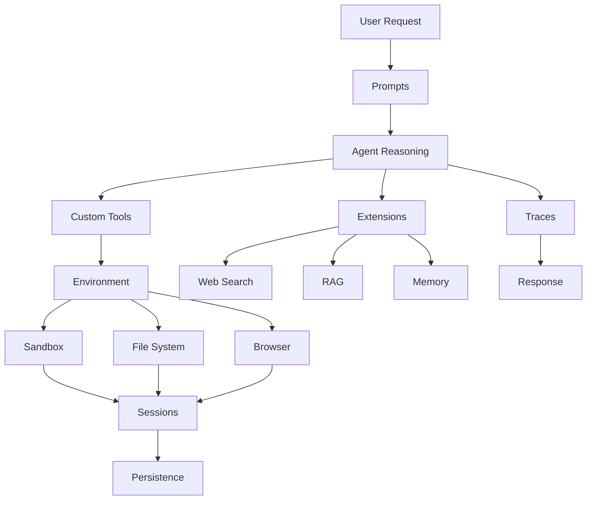

## What Are Agent Primitives?

Agent primitives are the fundamental building blocks that make up Agentbase agents. Understanding these primitives helps you build more sophisticated and capable agents.

<CardGroup cols={3}>
  <Card title="Environment" icon="server">
    Execution environments where agents operate
  </Card>

  <Card title="Essentials" icon="wrench">
    Core capabilities every agent needs
  </Card>

  <Card title="Extensions" icon="puzzle-piece">
    Advanced features for specialized use cases
  </Card>
</CardGroup>

## Environment Primitives

The runtime environment where agents execute tasks.

<CardGroup cols={2}>
  <Card title="Sandbox" icon="box" href="/primitives/environment/sandbox">
    Isolated, secure execution environment for each agent
  </Card>

  <Card title="File System" icon="folder" href="/primitives/environment/file-system">
    Persistent file storage and management
  </Card>

  <Card title="Computer" icon="desktop" href="/primitives/environment/computer">
    Full Linux environment with shell access
  </Card>

  <Card title="Browser" icon="browser" href="/primitives/environment/browser">
    Web browser automation and interaction
  </Card>
</CardGroup>

## Essential Primitives

Core capabilities that power agent functionality.

<AccordionGroup>
  <Accordion title="Interaction & Control" icon="hand">
    - **[Prompts](/primitives/essentials/prompts)** - Natural language instructions and system prompts
    - **[Custom Tools](/primitives/essentials/custom-tools)** - Extend agent capabilities with your own tools
    - **[Hooks](/primitives/essentials/hooks)** - Event-driven triggers and callbacks
  </Accordion>

  <Accordion title="State & Memory" icon="database">
    - **[States](/primitives/essentials/states)** - Manage agent state and variables
    - **[Sessions](/primitives/essentials/sessions)** - Persistent conversations and context
    - **[Persistence](/primitives/essentials/persistence)** - Long-term data storage
    - **[Context Management](/primitives/essentials/context-management)** - Optimize context window usage
  </Accordion>

  <Accordion title="Execution & Coordination" icon="gears">
    - **[Multi-Agents](/primitives/essentials/multi-agents)** - Coordinate multiple agents
    - **[Parallelization](/primitives/essentials/parallelization)** - Run tasks concurrently
    - **[Background](/primitives/essentials/background)** - Long-running async operations
  </Accordion>

  <Accordion title="Reliability & Evolution" icon="shield">
    - **[Self-Healing](/primitives/essentials/self-healing)** - Automatic error recovery
    - **[Self-Evolving](/primitives/essentials/self-evolving)** - Agents that improve over time
    - **[Versioning](/primitives/essentials/versioning)** - Track and manage agent versions
  </Accordion>

  <Accordion title="Observability" icon="eye">
    - **[Traces](/primitives/essentials/traces)** - Detailed execution logs and debugging
    - **[Evals](/primitives/essentials/evals)** - Quality assurance and testing
  </Accordion>
</AccordionGroup>

## Extension Primitives

Advanced features for specialized use cases.

<AccordionGroup>
  <Accordion title="Intelligence & Learning" icon="brain">
    - **[Memory](/primitives/extensions/memory)** - Long-term memory and recall
    - **[RAG](/primitives/extensions/rag)** - Retrieval-Augmented Generation
    - **[Workflow](/primitives/extensions/workflow)** - Complex multi-step workflows
    - **[Orchestration](/primitives/extensions/orchestration)** - Coordinate complex agent systems
  </Accordion>

  <Accordion title="Data & Integration" icon="database">
    - **[Data Connectors](/primitives/extensions/data-connectors)** - Connect to external data sources
    - **[Integrations](/primitives/extensions/integrations)** - Third-party service integrations
    - **[MCP](/primitives/extensions/mcp)** - Model Context Protocol support
  </Accordion>

  <Accordion title="Web & Content" icon="globe">
    - **[Web Search](/primitives/extensions/web-search)** - Real-time web search
    - **[Crawl & Scrape](/primitives/extensions/crawl-scrape)** - Extract data from websites
    - **[OCR](/primitives/extensions/ocr)** - Extract text from images
    - **[Email](/primitives/extensions/email)** - Send and receive emails
  </Accordion>

  <Accordion title="User Experience" icon="user">
    - **[Voice](/primitives/extensions/voice)** - Voice interaction and synthesis
    - **[Interface](/primitives/extensions/interface)** - UI components and widgets
    - **[Authentication](/primitives/extensions/authentication)** - User authentication and authorization
  </Accordion>

  <Accordion title="Automation & Scheduling" icon="clock">
    - **[Tasks](/primitives/extensions/tasks)** - Structured task management
    - **[Skills](/primitives/extensions/skills)** - Reusable agent capabilities
    - **[Trigger](/primitives/extensions/trigger)** - Event-based automation
    - **[Scheduling](/primitives/extensions/scheduling)** - Time-based execution
  </Accordion>
</AccordionGroup>

## How Primitives Work Together

Primitives combine to create powerful agent capabilities:



### Example: Research Agent

A research agent might use these primitives:

<Steps>
  <Step title="Input via Prompts">
    User provides research query through natural language prompt
  </Step>

  <Step title="Web Search Extension">
    Agent uses web search to find relevant sources
  </Step>

  <Step title="Browser Environment">
    Navigates to websites and extracts content
  </Step>

  <Step title="RAG Extension">
    Stores and retrieves information from documents
  </Step>

  <Step title="File System">
    Saves research findings and generates report
  </Step>

  <Step title="Session Persistence">
    Maintains context across multiple queries
  </Step>

  <Step title="Traces">
    Logs all steps for debugging and optimization
  </Step>
</Steps>

## Choosing the Right Primitives

<CardGroup cols={2}>
  <Card title="Start Simple" icon="seedling">
    Begin with essential primitives (prompts, sessions, file system)
  </Card>

  <Card title="Add as Needed" icon="plus">
    Incorporate extensions when requirements grow
  </Card>

  <Card title="Consider Performance" icon="gauge">
    More primitives = more complexity (balance capability vs. efficiency)
  </Card>

  <Card title="Test Thoroughly" icon="vial">
    Use traces and evals to validate primitive interactions
  </Card>
</CardGroup>

## Common Patterns

### Pattern 1: Simple Task Execution

**Primitives:** Prompts + Sandbox + Traces

```typescript
// Simple code execution
const result = await agentbase.runAgent({
  message: "Create a Python function to calculate fibonacci",
  mode: "base"
});
```

### Pattern 2: Stateful Conversation

**Primitives:** Prompts + Sessions + Context Management

```typescript
// Multi-turn conversation
const result1 = await agentbase.runAgent({
  message: "Analyze data.csv"
});

const result2 = await agentbase.runAgent({
  message: "Now create a visualization",
  session: result1.session
});
```

### Pattern 3: Research & Analysis

**Primitives:** Web Search + Browser + RAG + File System

```typescript
// Research task
const result = await agentbase.runAgent({
  message: "Research our top 3 competitors and create a comparison report",
  mode: "max"
});
```

### Pattern 4: Automated Workflow

**Primitives:** Scheduling + Tasks + Hooks + Email

```typescript
// Scheduled automation
const result = await agentbase.runAgent({
  message: "Check competitor pricing daily and email me if prices change",
  mode: "base"
});
```

### Pattern 5: Multi-Agent System

**Primitives:** Multi-Agents + Orchestration + Parallelization

```typescript
// Coordinated agents
const result = await agentbase.runAgent({
  message: "Use one agent to gather data and another to analyze it",
  mode: "max"
});
```

## Learning Path

<Steps>
  <Step title="Start with Environment">
    Understand the [sandbox](/primitives/environment/sandbox), [file system](/primitives/environment/file-system), and [computer](/primitives/environment/computer) primitives
  </Step>

  <Step title="Master Essentials">
    Learn [prompts](/primitives/essentials/prompts), [sessions](/primitives/essentials/sessions), and [custom tools](/primitives/essentials/custom-tools)
  </Step>

  <Step title="Add Extensions">
    Explore extensions like [web search](/primitives/extensions/web-search), [RAG](/primitives/extensions/rag), and [memory](/primitives/extensions/memory) as needed
  </Step>

  <Step title="Optimize & Monitor">
    Use [traces](/primitives/essentials/traces), [evals](/primitives/essentials/evals), and [versioning](/primitives/essentials/versioning)
  </Step>
</Steps>

## Next Steps

<CardGroup cols={2}>
  <Card title="Environment Primitives" icon="server" href="/primitives/environment/sandbox">
    Start with execution environments
  </Card>

  <Card title="Essential Primitives" icon="wrench" href="/primitives/essentials/prompts">
    Learn core capabilities
  </Card>

  <Card title="Extension Primitives" icon="puzzle-piece" href="/primitives/extensions/memory">
    Explore advanced features
  </Card>

  <Card title="Build Guide" icon="hammer" href="/build/overview">
    See primitives in action
  </Card>
</CardGroup>
